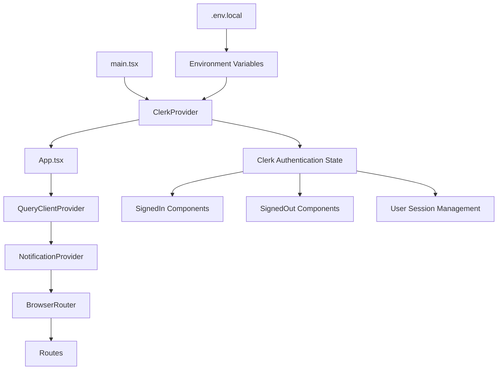

# Design Document - Clerk Authentication Integration

## Overview

This design document outlines the integration of Clerk authentication system into the existing React Vite application. The current application uses a `NoAuthProvider` system that simulates authentication without actual user management. The Clerk integration will replace this system with a robust, production-ready authentication solution while maintaining the existing application structure and user experience.

The integration will leverage Clerk's React SDK to provide sign-in, sign-up, user management, and session handling capabilities. The design ensures minimal disruption to existing components while providing enhanced security and user management features.

## Architecture

### Current Architecture Analysis

The application currently uses:
- **NoAuthProvider**: A context provider that simulates authentication with a default user
- **React Router**: For navigation and routing
- **Vite**: As the build tool with environment variable support
- **Appwrite**: Currently configured but will be complemented by Clerk for authentication

### Target Architecture



### Integration Strategy

1. **Gradual Migration**: Replace NoAuthProvider with ClerkProvider while maintaining existing route structure
2. **Environment Configuration**: Add Clerk-specific environment variables alongside existing ones
3. **Component Wrapping**: Use Clerk's conditional rendering components around existing protected routes
4. **Session Management**: Leverage Clerk's built-in session handling to replace custom authentication logic

## Components and Interfaces

### Core Clerk Components Integration

#### 1. ClerkProvider Setup
- **Location**: `src/main.tsx`
- **Purpose**: Wrap the entire application with Clerk's authentication context
- **Configuration**: 
  - `publishableKey`: From environment variable `VITE_CLERK_PUBLISHABLE_KEY`
  - `afterSignOutUrl`: Redirect to "/" after sign-out

#### 2. Authentication UI Components
- **SignInButton**: For unauthenticated users to initiate sign-in
- **SignUpButton**: For new user registration
- **UserButton**: For authenticated users to manage account and sign-out
- **SignedIn**: Wrapper component for authenticated-only content
- **SignedOut**: Wrapper component for unauthenticated-only content

#### 3. Route Protection Strategy
```typescript
// Protected Route Pattern
<SignedIn>
  <AppLayout>
    <ProtectedComponent />
  </AppLayout>
</SignedIn>

// Public Route Pattern  
<SignedOut>
  <PublicComponent />
</SignedOut>
```

### Interface Definitions

#### Environment Configuration Interface
```typescript
interface ClerkEnvironmentConfig {
  VITE_CLERK_PUBLISHABLE_KEY: string;
  // Existing environment variables remain unchanged
  VITE_APPWRITE_ENDPOINT?: string;
  VITE_APPWRITE_PROJECT_ID?: string;
  // ... other existing variables
}
```

#### Authentication State Interface
```typescript
interface ClerkAuthState {
  isSignedIn: boolean;
  user: User | null;
  isLoaded: boolean;
  signOut: () => Promise<void>;
}
```

## Data Models

### User Data Model
Clerk provides a comprehensive user object with the following key properties:
- `id`: Unique user identifier
- `emailAddresses`: Array of email addresses
- `firstName`: User's first name
- `lastName`: User's last name
- `imageUrl`: Profile image URL
- `createdAt`: Account creation timestamp
- `updatedAt`: Last update timestamp

### Session Data Model
Clerk manages sessions automatically with:
- `sessionId`: Unique session identifier
- `status`: Session status (active, expired, etc.)
- `expireAt`: Session expiration timestamp
- `lastActiveAt`: Last activity timestamp

## Error Handling

### Authentication Error Categories

#### 1. Configuration Errors
- **Missing Publishable Key**: Clear error message when `VITE_CLERK_PUBLISHABLE_KEY` is not set
- **Invalid Key Format**: Validation of publishable key format
- **Network Configuration**: Handling of network-related setup issues

#### 2. User Authentication Errors
- **Invalid Credentials**: Display user-friendly messages for login failures
- **Account Locked**: Handle temporarily locked accounts
- **Email Verification**: Guide users through email verification process
- **Password Requirements**: Clear feedback on password strength requirements

#### 3. Session Management Errors
- **Expired Sessions**: Automatic redirect to sign-in when session expires
- **Network Interruptions**: Retry mechanisms for network-related issues
- **Concurrent Sessions**: Handle multiple session scenarios

### Error Handling Implementation
```typescript
// Error boundary for Clerk-specific errors
const ClerkErrorBoundary = ({ children }) => {
  return (
    <ErrorBoundary
      fallback={<AuthenticationErrorFallback />}
      onError={(error) => {
        if (error.message.includes('Clerk')) {
          // Handle Clerk-specific errors
          console.error('Clerk Authentication Error:', error);
        }
      }}
    >
      {children}
    </ErrorBoundary>
  );
};
```

## Testing Strategy

### Unit Testing
- **Component Testing**: Test Clerk component integration with React Testing Library
- **Hook Testing**: Test custom hooks that interact with Clerk's useAuth and useUser hooks
- **Error Handling**: Test error scenarios and fallback behaviors

### Integration Testing
- **Authentication Flow**: Test complete sign-in/sign-up flows
- **Route Protection**: Verify protected routes redirect unauthenticated users
- **Session Management**: Test session persistence and expiration handling

### End-to-End Testing
- **User Journey**: Complete user authentication workflows
- **Cross-Browser**: Ensure compatibility across different browsers
- **Mobile Responsiveness**: Test authentication UI on mobile devices

### Testing Environment Setup
```typescript
// Mock Clerk for testing
jest.mock('@clerk/clerk-react', () => ({
  ClerkProvider: ({ children }) => children,
  SignedIn: ({ children }) => children,
  SignedOut: () => null,
  useAuth: () => ({ isSignedIn: true, user: mockUser }),
  useUser: () => ({ user: mockUser, isLoaded: true }),
}));
```

## Migration Strategy

### Phase 1: Environment Setup
1. Add Clerk publishable key to environment configuration
2. Install @clerk/clerk-react package
3. Update .gitignore to exclude .env.local

### Phase 2: Core Integration
1. Wrap application with ClerkProvider in main.tsx
2. Replace NoAuthProvider with Clerk authentication state
3. Update existing components to use Clerk's authentication hooks

### Phase 3: UI Integration
1. Add authentication UI components (SignInButton, SignUpButton, UserButton)
2. Implement conditional rendering with SignedIn/SignedOut components
3. Update navigation and layout components

### Phase 4: Route Protection
1. Protect existing routes with SignedIn wrapper
2. Create public landing page for unauthenticated users
3. Implement proper redirects and navigation flow

### Phase 5: Testing and Validation
1. Comprehensive testing of authentication flows
2. Error handling validation
3. Performance and security testing

## Security Considerations

### Environment Variable Security
- Store publishable key in .env.local (not tracked by git)
- Use VITE_ prefix for client-side environment variables
- Validate environment variables at application startup

### Session Security
- Leverage Clerk's built-in session security features
- Implement proper CSRF protection
- Use secure cookie settings for session management

### Data Protection
- Ensure user data is handled according to privacy regulations
- Implement proper data encryption for sensitive information
- Use Clerk's built-in security features for user data protection