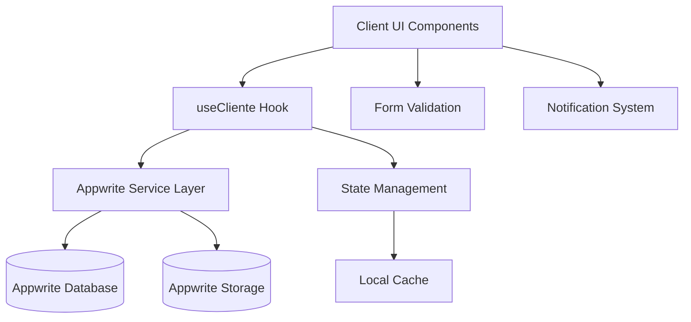

# Design Document

## Overview

This design outlines the complete overhaul of the client management system to provide fully functional CRUD operations with proper Appwrite integration. The system will replace mock data with real database operations, fix all service layer issues, and provide a professional user experience.

## Architecture

### System Components



### Data Flow

1. **Create Flow**: Form → Validation → Hook → Service → Appwrite → Success/Error
2. **Read Flow**: Component Mount → Hook → Service → Appwrite → State Update → UI Render
3. **Update Flow**: Edit Form → Validation → Hook → Service → Appwrite → State Update → UI Refresh
4. **Delete Flow**: Delete Action → Confirmation → Hook → Service → Appwrite → State Update → UI Refresh

## Components and Interfaces

### 1. Service Layer Redesign

**AppwriteClientesService**
- Fix all compilation errors and missing imports
- Implement proper Appwrite client initialization
- Add comprehensive error handling
- Implement proper data transformation methods
- Add file upload capabilities

**Key Methods:**
```typescript
interface AppwriteClientesService {
  createCliente(data: ClienteFormData): Promise<AppwriteResponse<Cliente>>
  updateCliente(id: string, data: Partial<ClienteFormData>): Promise<AppwriteResponse<Cliente>>
  getCliente(id: string): Promise<AppwriteResponse<Cliente>>
  getClientes(filters?: ClienteFilters): Promise<AppwriteResponse<ClienteList>>
  deleteCliente(id: string): Promise<AppwriteResponse<void>>
  uploadAvatar(clienteId: string, file: File): Promise<AppwriteResponse<string>>
  uploadDocument(clienteId: string, file: File, type: string): Promise<AppwriteResponse<string>>
  checkEmailExists(email: string, excludeId?: string): Promise<AppwriteResponse<boolean>>
}
```

### 2. Hook Enhancement

**useCliente Hook**
- Fix all import errors
- Add proper error handling with user-friendly messages
- Implement loading states for all operations
- Add optimistic updates for better UX
- Integrate with notification system

**State Management:**
```typescript
interface UseClienteState {
  clientes: Cliente[]
  loading: boolean
  creating: boolean
  updating: boolean
  deleting: boolean
  uploadingAvatar: boolean
  uploadingDocument: boolean
  error: string | null
}
```

### 3. UI Component Updates

**Clientes Page**
- Replace mock data with real data from hook
- Add proper loading states
- Implement real-time search and filtering
- Add error handling and retry mechanisms
- Improve empty states

**NovoClienteModal**
- Fix form validation issues
- Implement proper file upload with progress
- Add better error display
- Implement edit mode functionality
- Add confirmation dialogs for destructive actions

**ClienteCard**
- Add action buttons (edit, delete)
- Implement proper click handling
- Add loading states for individual cards
- Show real data instead of mock data

### 4. Data Models

**Cliente Interface Updates**
```typescript
interface Cliente {
  id: string
  nome: string
  email: string
  telefone: string
  cpf?: string
  dataNascimento?: Date
  foto?: string
  endereco: {
    cep?: string
    rua?: string
    numero?: string
    complemento?: string
    bairro?: string
    cidade?: string
    estado?: string
  }
  categoria: 'premium' | 'vip' | 'regular' | 'novo' | 'risco' | 'sazonal'
  tags: ClienteTag[]
  ltv: number
  frequencia: number
  ultimoAtendimento?: Date
  proximoAgendamento?: Date
  nps?: number
  observacoes?: string
  documentos?: ClienteDocument[]
  createdAt: Date
  updatedAt: Date
}
```

## Error Handling

### Error Categories

1. **Validation Errors**: Client-side form validation
2. **Network Errors**: Connection issues, timeouts
3. **Authentication Errors**: Invalid credentials, expired sessions
4. **Business Logic Errors**: Duplicate emails, invalid operations
5. **File Upload Errors**: Size limits, format restrictions

### Error Display Strategy

- **Form Errors**: Inline field validation with red borders and error text
- **Operation Errors**: Toast notifications with retry options
- **Critical Errors**: Modal dialogs with detailed information
- **Network Errors**: Retry mechanisms with exponential backoff

## Testing Strategy

### Unit Tests
- Service layer methods with mocked Appwrite responses
- Hook functionality with various scenarios
- Form validation logic
- Data transformation functions

### Integration Tests
- Complete CRUD workflows
- File upload processes
- Error handling scenarios
- Real-time data updates

### User Acceptance Tests
- Client creation workflow
- Client editing workflow
- Search and filtering functionality
- File upload and management
- Error recovery scenarios

## Performance Considerations

### Optimization Strategies

1. **Lazy Loading**: Load client details only when needed
2. **Pagination**: Implement server-side pagination for large datasets
3. **Caching**: Cache frequently accessed client data
4. **Debounced Search**: Prevent excessive API calls during search
5. **Optimistic Updates**: Update UI immediately, rollback on error

### File Upload Optimization

1. **Progressive Upload**: Show upload progress
2. **File Compression**: Compress images before upload
3. **Chunked Upload**: Handle large files efficiently
4. **Background Upload**: Allow users to continue working during upload

## Security Considerations

### Data Protection
- Encrypt sensitive personal information
- Implement proper access controls
- Validate all inputs on client and server side
- Use secure file upload practices

### LGPD Compliance
- Implement consent management
- Provide data export functionality
- Enable data deletion requests
- Maintain audit logs for data access

## Implementation Phases

### Phase 1: Service Layer Fix
- Fix all compilation errors
- Implement proper Appwrite integration
- Add comprehensive error handling
- Test basic CRUD operations

### Phase 2: Hook Integration
- Update useCliente hook
- Implement proper state management
- Add loading and error states
- Test hook functionality

### Phase 3: UI Updates
- Update Clientes page to use real data
- Fix modal functionality
- Implement proper error display
- Add loading states

### Phase 4: File Upload
- Implement avatar upload
- Add document upload functionality
- Create file management interface
- Test upload workflows

### Phase 5: Polish and Testing
- Add comprehensive error handling
- Implement optimistic updates
- Add loading animations
- Conduct thorough testing