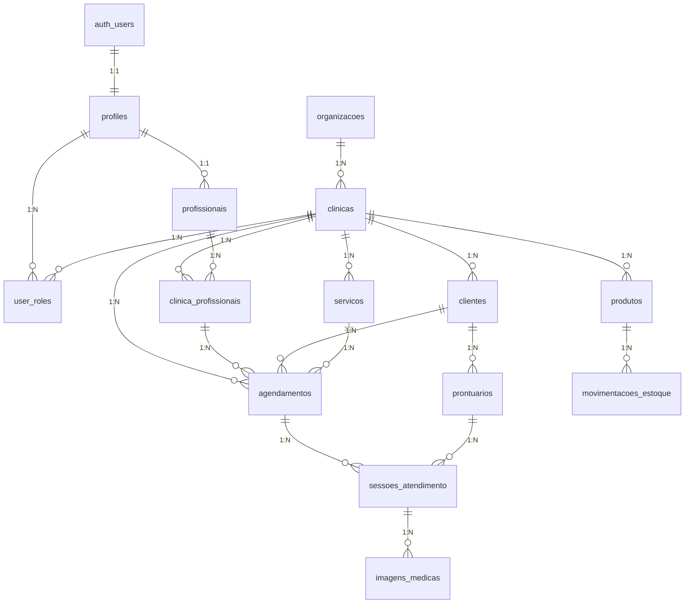

# Design Document - Completar SaaS de Clínicas de Estética

## Overview

Este documento apresenta o design técnico para **COMPLETAR** a implementação do sistema SaaS multi-tenant para clínicas de estética. O foco é criar toda a infraestrutura de banco de dados e conectar com a interface já desenvolvida. Temos 70% do frontend implementado com qualidade premium, mas 0% do backend funcional.

## Situação Atual Detalhada

### ✅ **Assets Implementados (Qualidade Premium)**

#### Frontend Sofisticado
- **React 18 + TypeScript**: Configuração moderna e type-safe
- **Componentes Premium**: AgendaViewPremium, DashboardExecutivo, VipDashboard
- **Serviços Inteligentes**: SmartSchedulingEngine, VIPSchedulingService, RevenueOptimizer
- **Design System**: Shadcn/ui com tema customizado e animações Framer Motion
- **Roteamento Avançado**: Proteção por roles, guards de autenticação
- **Estados Complexos**: Zustand + React Query para gerenciamento otimizado

#### Arquitetura Frontend Sólida
```typescript
// Exemplo da qualidade do código existente
export class SmartSchedulingEngine {
  async findOptimalSlot(criteria: SchedulingCriteria): Promise<OptimalSlot[]>
  async detectConflicts(agendamento: AgendamentoData): Promise<ConflictAnalysis>
  async suggestAlternatives(agendamento: AgendamentoData): Promise<AlternativeSlot[]>
}
```

### ❌ **Lacunas Críticas (Bloqueadores)**

#### 1. Banco de Dados Inexistente
```sql
-- ATUAL: supabase/migrations/20250915123111_remote_schema.sql
-- ARQUIVO VAZIO! 

-- NECESSÁRIO: Estrutura completa com 15+ tabelas
```

#### 2. Supabase Client Mock
```typescript
// ATUAL: src/lib/supabase.ts
export const supabase = {
  auth: { getUser: jest.fn() }, // MOCK!
  from: jest.fn(),
  rpc: jest.fn()
};
```

## Architecture

### Database Schema (IMPLEMENTAR URGENTE)



### Priorização de Implementação

#### FASE 1: FUNDAÇÃO (CRÍTICA - 1 semana)
1. **Migração Completa do Banco**
   - Criar todas as tabelas fundamentais
   - Implementar RLS policies
   - Configurar índices de performance
   - Criar triggers de auditoria

2. **Supabase Client Real**
   - Substituir mock por cliente real
   - Configurar variáveis de ambiente
   - Implementar error handling

3. **Tabelas Core**
   - `profiles` - Perfis de usuários
   - `organizacoes` - Estrutura organizacional
   - `clinicas` - Dados das clínicas
   - `user_roles` - Sistema de permissões

#### FASE 2: OPERACIONAL (CRÍTICA - 1 semana)
4. **Sistema de Agendamentos**
   - `agendamentos` - Tabela principal
   - `bloqueios_agenda` - Bloqueios de horário
   - Conectar com AgendaViewPremium existente

5. **Gestão de Clientes**
   - `clientes` - Dados completos
   - Conectar com componentes existentes
   - Implementar busca e filtros

6. **Profissionais e Vínculos**
   - `profissionais` - Dados profissionais
   - `clinica_profissionais` - Relacionamentos
   - Conectar com sistema de permissões

#### FASE 3: AVANÇADO (2 semanas)
7. **Catálogo de Serviços**
   - `servicos` - Catálogo completo
   - `templates_procedimentos` - Templates
   - Conectar com sistema de agendamento

8. **Estoque e Produtos**
   - `produtos` - Gestão de estoque
   - `movimentacoes_estoque` - Auditoria
   - Sistema de alertas

9. **Prontuários Digitais**
   - `prontuarios` - Dados médicos
   - `sessoes_atendimento` - Registros
   - `imagens_medicas` - Fotos seguras

## Components Integration Strategy

### Conectar Interface Existente com Dados Reais

#### 1. AgendaViewPremium → Banco Real
```typescript
// ATUAL: Dados mockados
const agendamentos = mockData;

// IMPLEMENTAR: Dados reais do Supabase
const { data: agendamentos } = await supabase
  .from('agendamentos')
  .select(`
    *,
    cliente:clientes(nome, categoria),
    profissional:profissionais(nome),
    servico:servicos(nome, duracao_minutos)
  `)
  .eq('clinica_id', clinicaId)
  .gte('data_agendamento', startOfDay(currentDate))
  .lte('data_agendamento', endOfDay(currentDate));
```

#### 2. SmartSchedulingEngine → Funções Reais
```typescript
// ATUAL: Mock functions
const { data } = await supabase.rpc('mock_function');

// IMPLEMENTAR: Funções reais do banco
const { data } = await supabase.rpc('buscar_horarios_disponiveis', {
  p_profissional_id: profissionalId,
  p_data_inicio: dataInicio,
  p_duracao_minutos: duracao
});
```

#### 3. DashboardExecutivo → Métricas Reais
```typescript
// ATUAL: Dados simulados
const metrics = generateMockMetrics();

// IMPLEMENTAR: Cálculos reais
const { data: metrics } = await supabase.rpc('calcular_metricas_executivas', {
  clinica_id: clinicaId,
  periodo_inicio: inicio,
  periodo_fim: fim
});
```

## Data Models

### Core Tables Schema

#### 1. Profiles (CRÍTICO)
```sql
CREATE TABLE public.profiles (
    id UUID PRIMARY KEY REFERENCES auth.users(id),
    email TEXT NOT NULL,
    nome_completo TEXT NOT NULL,
    telefone TEXT,
    avatar_url TEXT,
    organizacao_id UUID REFERENCES organizacoes(id),
    ativo BOOLEAN DEFAULT true,
    criado_em TIMESTAMPTZ DEFAULT now(),
    atualizado_em TIMESTAMPTZ DEFAULT now()
);
```

#### 2. Agendamentos (CRÍTICO)
```sql
CREATE TABLE public.agendamentos (
    id UUID PRIMARY KEY DEFAULT gen_random_uuid(),
    clinica_id UUID NOT NULL REFERENCES clinicas(id),
    cliente_id UUID NOT NULL REFERENCES clientes(id),
    profissional_id UUID NOT NULL REFERENCES auth.users(id),
    servico_id UUID NOT NULL REFERENCES servicos(id),
    data_agendamento TIMESTAMPTZ NOT NULL,
    duracao_minutos INTEGER NOT NULL,
    status status_agendamento DEFAULT 'agendado',
    prioridade prioridade_agendamento DEFAULT 'normal',
    valor_servico DECIMAL(10,2) NOT NULL,
    valor_final DECIMAL(10,2) NOT NULL,
    observacoes TEXT,
    observacoes_internas TEXT,
    criado_em TIMESTAMPTZ DEFAULT now(),
    criado_por UUID NOT NULL REFERENCES auth.users(id)
);
```

#### 3. Clientes (CRÍTICO)
```sql
CREATE TABLE public.clientes (
    id UUID PRIMARY KEY DEFAULT gen_random_uuid(),
    clinica_id UUID NOT NULL REFERENCES clinicas(id),
    nome TEXT NOT NULL,
    cpf TEXT,
    telefone TEXT NOT NULL,
    email TEXT,
    data_nascimento DATE,
    endereco JSONB,
    categoria categoria_cliente DEFAULT 'regular',
    nivel_vip nivel_vip,
    preferencias JSONB DEFAULT '{}',
    observacoes_medicas TEXT,
    ativo BOOLEAN DEFAULT true,
    criado_em TIMESTAMPTZ DEFAULT now()
);
```

### RLS Policies (SEGURANÇA CRÍTICA)

```sql
-- Isolamento multi-tenant rigoroso
CREATE POLICY "Clientes isolados por clínica" ON clientes
    FOR ALL USING (
        clinica_id IN (
            SELECT clinica_id FROM user_roles 
            WHERE user_id = auth.uid()
        )
    );

CREATE POLICY "Agendamentos isolados por clínica" ON agendamentos
    FOR ALL USING (
        clinica_id IN (
            SELECT clinica_id FROM user_roles 
            WHERE user_id = auth.uid()
        )
    );
```

## Error Handling & Recovery

### Database Connection Issues
```typescript
export class DatabaseRecoveryService {
  async ensureConnection(): Promise<boolean> {
    try {
      const { data, error } = await supabase.from('profiles').select('id').limit(1);
      return !error;
    } catch {
      return false;
    }
  }

  async repairMissingTables(): Promise<RepairResult> {
    // Verificar e criar tabelas faltantes
    // Executar migrações pendentes
    // Reparar dados órfãos
  }
}
```

### Data Integrity Checks
```sql
-- Função para verificar integridade
CREATE OR REPLACE FUNCTION check_data_integrity()
RETURNS JSONB AS $$
DECLARE
    result JSONB := '{}';
    missing_profiles INTEGER;
    orphaned_agendamentos INTEGER;
BEGIN
    -- Verificar profiles faltantes
    SELECT COUNT(*) INTO missing_profiles
    FROM auth.users u
    LEFT JOIN profiles p ON p.id = u.id
    WHERE p.id IS NULL;
    
    -- Verificar agendamentos órfãos
    SELECT COUNT(*) INTO orphaned_agendamentos
    FROM agendamentos a
    LEFT JOIN clientes c ON c.id = a.cliente_id
    WHERE c.id IS NULL;
    
    result := jsonb_build_object(
        'missing_profiles', missing_profiles,
        'orphaned_agendamentos', orphaned_agendamentos,
        'status', CASE 
            WHEN missing_profiles = 0 AND orphaned_agendamentos = 0 
            THEN 'healthy' 
            ELSE 'needs_repair' 
        END
    );
    
    RETURN result;
END;
$$ LANGUAGE plpgsql SECURITY DEFINER;
```

## Performance Optimization

### Critical Indexes
```sql
-- Índices para queries frequentes
CREATE INDEX idx_agendamentos_clinica_data ON agendamentos(clinica_id, data_agendamento);
CREATE INDEX idx_agendamentos_profissional_data ON agendamentos(profissional_id, data_agendamento);
CREATE INDEX idx_clientes_clinica_nome ON clientes(clinica_id, nome);
CREATE INDEX idx_user_roles_user_clinica ON user_roles(user_id, clinica_id);
```

### Query Optimization
```sql
-- View materializada para dashboard
CREATE MATERIALIZED VIEW dashboard_metricas AS
SELECT 
    clinica_id,
    DATE(data_agendamento) as data,
    COUNT(*) as total_agendamentos,
    SUM(valor_final) as receita_dia,
    COUNT(CASE WHEN status = 'finalizado' THEN 1 END) as finalizados
FROM agendamentos
WHERE data_agendamento >= CURRENT_DATE - INTERVAL '30 days'
GROUP BY clinica_id, DATE(data_agendamento);

-- Refresh automático
CREATE OR REPLACE FUNCTION refresh_dashboard_metricas()
RETURNS void AS $$
BEGIN
    REFRESH MATERIALIZED VIEW dashboard_metricas;
END;
$$ LANGUAGE plpgsql;
```

## Testing Strategy

### Database Testing
1. **Schema Validation**
   - Verificar criação de todas as tabelas
   - Validar constraints e relacionamentos
   - Testar RLS policies

2. **Data Integrity**
   - Testar inserção/atualização/exclusão
   - Verificar triggers de auditoria
   - Validar cálculos automáticos

3. **Performance Testing**
   - Testar queries com dados reais
   - Validar índices otimizados
   - Monitorar tempos de resposta

### Integration Testing
1. **Frontend ↔ Backend**
   - Testar todos os componentes com dados reais
   - Validar fluxos completos de CRUD
   - Verificar tratamento de erros

2. **Multi-tenant Isolation**
   - Testar isolamento entre clínicas
   - Verificar permissões por role
   - Validar segurança de dados

## Deployment Strategy

### Environment Setup
```bash
# Variáveis críticas
VITE_SUPABASE_URL=https://your-project.supabase.co
VITE_SUPABASE_ANON_KEY=your-anon-key
SUPABASE_SERVICE_ROLE_KEY=your-service-key
```

### Migration Execution
```bash
# Executar migrações
supabase db push

# Verificar integridade
supabase db functions deploy check_data_integrity

# Testar conexão
npm run test:db
```

### Monitoring
- **Supabase Dashboard**: Monitorar queries e performance
- **Error Tracking**: Sentry para erros de produção
- **Health Checks**: Endpoints para verificar status do sistema

## Security Considerations

### Data Protection
- **RLS Policies**: Isolamento rigoroso multi-tenant
- **Encryption**: Dados sensíveis criptografados
- **Audit Logs**: Rastreamento completo de operações
- **Backup**: Backup automático diário

### Access Control
- **Role-based**: Permissões granulares por função
- **Session Management**: Timeout automático
- **API Security**: Rate limiting e validação

### Compliance
- **LGPD**: Direito ao esquecimento implementado
- **Audit Trail**: Logs completos para auditoria
- **Data Portability**: Exportação de dados do cliente