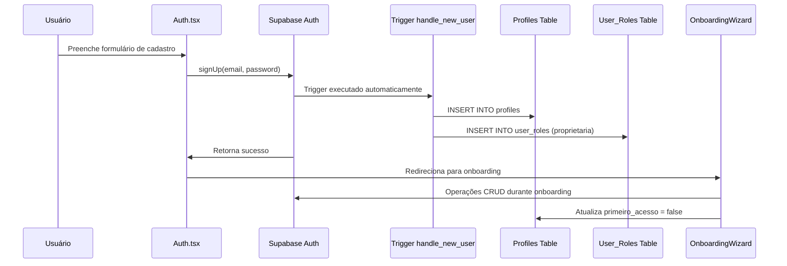

# Design Document

## Overview

O problema de cadastro está ocorrendo devido a inconsistências no fluxo de autenticação e nas políticas RLS (Row Level Security) do Supabase. Durante a análise, identifiquei que:

1. O trigger `handle_new_user()` está criando perfis e roles automaticamente, mas pode haver conflitos
2. As políticas RLS podem estar bloqueando operações necessárias durante o onboarding
3. O fluxo de redirecionamento entre cadastro e onboarding pode estar causando perda de sessão
4. Falta tratamento adequado de erros específicos do Supabase

## Architecture

### Componentes Principais

1. **AuthContext**: Gerencia estado de autenticação e perfil do usuário
2. **Trigger handle_new_user()**: Cria automaticamente perfil e role inicial
3. **Políticas RLS**: Controlam acesso às tabelas durante o cadastro
4. **OnboardingWizard**: Processo de configuração inicial da clínica
5. **AuthGuard**: Controla acesso às rotas baseado em autenticação e roles

### Fluxo de Dados



## Components and Interfaces

### 1. Correção do Trigger handle_new_user()

**Problema Atual**: O trigger pode estar falhando ou criando dados inconsistentes.

**Solução**:
- Adicionar tratamento de erros robusto
- Garantir que o perfil seja criado com dados mínimos válidos
- Verificar se o role 'proprietaria' é criado corretamente
- Adicionar logs para debugging

### 2. Atualização das Políticas RLS

**Problema Atual**: Políticas podem estar bloqueando operações necessárias.

**Soluções**:
- Política para permitir que usuários criem seus próprios perfis
- Política para permitir que proprietárias criem clínicas independentes
- Política para permitir atualização de user_roles pelo próprio usuário
- Política para permitir operações durante o onboarding

### 3. Melhoria do AuthContext

**Problema Atual**: Pode não estar lidando adequadamente com estados transitórios.

**Soluções**:
- Adicionar retry logic para buscar perfil/roles após cadastro
- Melhorar tratamento de estados de loading
- Adicionar função para verificar se onboarding foi completado
- Implementar refresh automático após operações críticas

### 4. Aprimoramento do OnboardingWizard

**Problema Atual**: Pode estar perdendo contexto de autenticação durante o processo.

**Soluções**:
- Verificar sessão antes de cada operação crítica
- Adicionar tratamento específico para erros de permissão
- Implementar retry automático para operações falhadas
- Melhorar feedback de erro para o usuário

## Data Models

### Profiles Table
```sql
CREATE TABLE public.profiles (
  id UUID PRIMARY KEY DEFAULT gen_random_uuid(),
  user_id UUID UNIQUE REFERENCES auth.users(id) ON DELETE CASCADE,
  nome_completo TEXT NOT NULL,
  email TEXT NOT NULL,
  telefone TEXT,
  avatar_url TEXT,
  ativo BOOLEAN DEFAULT true,
  primeiro_acesso BOOLEAN DEFAULT true,
  criado_em TIMESTAMP WITH TIME ZONE DEFAULT now(),
  atualizado_em TIMESTAMP WITH TIME ZONE DEFAULT now()
);
```

### User_Roles Table
```sql
CREATE TABLE public.user_roles (
  id UUID PRIMARY KEY DEFAULT gen_random_uuid(),
  user_id UUID REFERENCES auth.users(id) ON DELETE CASCADE,
  organizacao_id UUID REFERENCES public.organizacoes(id),
  clinica_id UUID REFERENCES public.clinicas(id),
  role user_role_type NOT NULL,
  ativo BOOLEAN DEFAULT true,
  criado_em TIMESTAMP WITH TIME ZONE DEFAULT now(),
  criado_por UUID NOT NULL
);
```

## Error Handling

### Tipos de Erro Identificados

1. **Erro de Permissão (403/insufficient_privilege)**
   - Causa: Políticas RLS bloqueando operação
   - Solução: Revisar e corrigir políticas RLS

2. **Erro de Chave Duplicada (23505)**
   - Causa: Tentativa de criar dados já existentes
   - Solução: Usar UPSERT ou verificar existência antes

3. **Erro de Sessão Perdida**
   - Causa: Redirecionamento ou refresh perdendo contexto
   - Solução: Verificar sessão e reautenticar se necessário

4. **Erro de Dados Faltantes**
   - Causa: Perfil ou role não criados automaticamente
   - Solução: Verificar e criar dados faltantes

### Estratégias de Tratamento

1. **Retry Logic**: Tentar novamente operações falhadas
2. **Fallback Creation**: Criar dados faltantes quando detectados
3. **User Feedback**: Mensagens claras sobre o que aconteceu
4. **Logging**: Registrar erros para debugging

## Testing Strategy

### Testes Unitários
- Testar trigger handle_new_user() com diferentes cenários
- Testar políticas RLS com diferentes roles
- Testar AuthContext com estados de erro
- Testar OnboardingWizard com falhas de rede

### Testes de Integração
- Testar fluxo completo de cadastro até onboarding
- Testar recuperação de erros durante o processo
- Testar comportamento com dados já existentes
- Testar redirecionamentos e manutenção de sessão

### Testes de Cenário
- Usuário novo fazendo primeiro cadastro
- Usuário tentando cadastrar com email já existente
- Usuário perdendo conexão durante onboarding
- Usuário fechando browser e retornando

### Validação Manual
- Testar em diferentes browsers
- Testar com diferentes velocidades de conexão
- Testar interrupções durante o processo
- Verificar logs do Supabase para erros