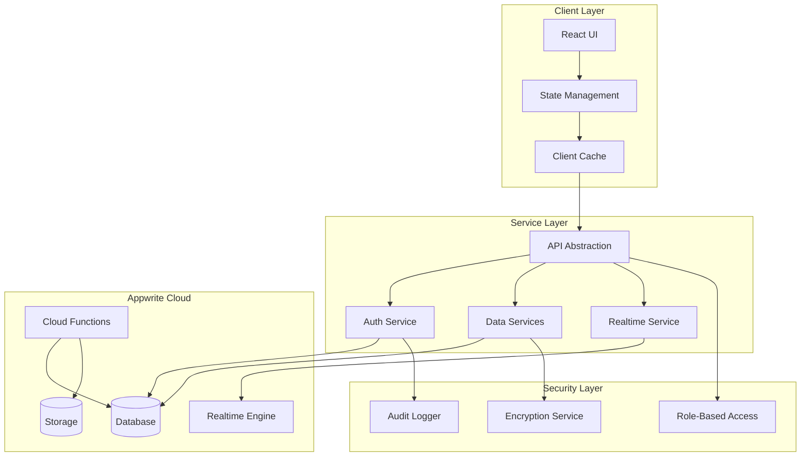
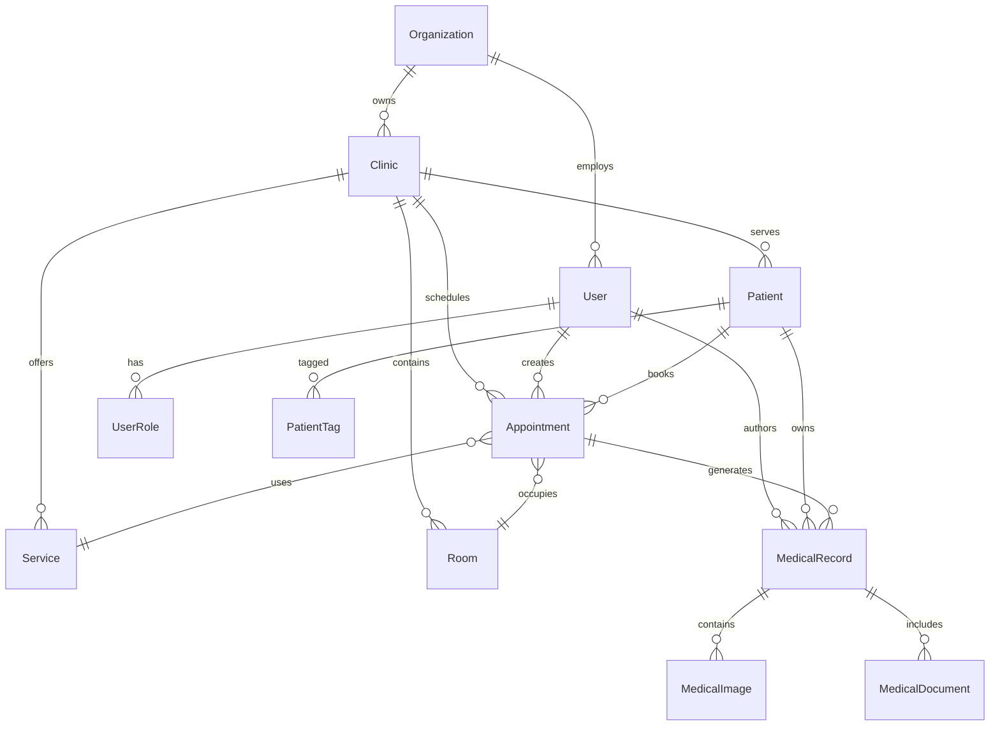

# Design Document

## Overview

Este documento apresenta o design otimizado para a migração do Supabase para o Appwrite, incorporando análise crítica do planejamento existente e implementando padrões de arquitetura de nível enterprise. O design foca em eliminar riscos identificados, otimizar performance, garantir segurança máxima e criar uma base sólida para escalabilidade futura.

## Architecture

### Arquitetura Geral Otimizada



### Princípios Arquiteturais

1. **Separation of Concerns**: Camadas bem definidas com responsabilidades específicas
2. **Fail-Safe Design**: Sistema resiliente com fallbacks automáticos
3. **Performance First**: Otimizações em todos os níveis da stack
4. **Security by Design**: Segurança implementada desde a base
5. **Scalability Ready**: Preparado para crescimento exponencial

## Components and Interfaces

### 1. Database Schema Otimizado

#### Melhorias Identificadas no Planejamento Atual

**Problemas Encontrados:**
- Redundância em campos de auditoria
- Falta de padronização em nomenclatura
- Índices não otimizados para queries reais
- Estrutura de permissões muito permissiva

**Soluções Propostas:**

```typescript
// Base interface para todas as collections
interface BaseDocument {
  $id: string;
  tenantId: string;
  createdAt: Date;
  updatedAt: Date;
  createdBy: string;
  updatedBy?: string;
  version: number;
  isActive: boolean;
}

// Mixin para auditoria
interface AuditableDocument extends BaseDocument {
  auditLog: Array<{
    action: 'create' | 'update' | 'delete' | 'view';
    timestamp: Date;
    userId: string;
    changes?: Record<string, any>;
    ip?: string;
    userAgent?: string;
  }>;
}

// Mixin para dados sensíveis
interface EncryptedDocument extends BaseDocument {
  encryptedFields: string[];
  encryptionVersion: string;
  dataHash: string;
}
```

#### Collections Otimizadas (Top 10 Críticas)

```typescript
// 1. organizations - Estrutura simplificada e otimizada
interface Organization extends BaseDocument {
  name: string;
  slug: string; // URL-friendly identifier
  cnpj?: string; // Encrypted
  plan: 'basic' | 'premium' | 'enterprise';
  status: 'active' | 'suspended' | 'cancelled';
  
  // Configurações em documento separado para performance
  settingsId?: string; // FK para organization_settings
  
  // Métricas em cache para dashboard
  metrics: {
    totalClinics: number;
    totalUsers: number;
    storageUsedMB: number;
    lastActivityAt: Date;
  };
  
  // Billing info encrypted
  billingInfoEncrypted?: string;
}

// 2. clinics - Otimizada para queries frequentes
interface Clinic extends BaseDocument {
  organizationId: string;
  name: string;
  slug: string;
  type: 'main' | 'branch';
  
  // Dados de contato estruturados
  contact: {
    phone: string;
    whatsapp?: string;
    email: string;
  };
  
  // Endereço normalizado para busca geográfica
  address: {
    street: string;
    number: string;
    complement?: string;
    neighborhood: string;
    city: string;
    state: string;
    zipCode: string;
    coordinates?: [number, number]; // [lat, lng]
  };
  
  // Configurações críticas inline para performance
  settings: {
    timezone: string;
    defaultAppointmentDuration: number;
    workingHours: Record<string, { start: string; end: string }>;
  };
  
  // Status operacional
  operationalStatus: 'active' | 'maintenance' | 'closed';
}

// 3. patients - Otimizada para LGPD e performance
interface Patient extends EncryptedDocument, AuditableDocument {
  clinicId: string;
  code: string; // Código interno único por clínica
  
  // Dados pessoais criptografados
  personalInfoEncrypted: string; // JSON criptografado
  
  // Dados não sensíveis para busca
  searchableData: {
    firstNameHash: string; // Hash para busca
    phoneHash: string;
    emailHash: string;
    birthYear: number; // Apenas ano para estatísticas
  };
  
  // Métricas de negócio
  businessMetrics: {
    ltv: number;
    totalSpent: number;
    appointmentCount: number;
    lastAppointmentAt?: Date;
    averageTicket: number;
    churnRisk: 'low' | 'medium' | 'high';
  };
  
  // Consentimentos LGPD
  consents: {
    lgpdAccepted: boolean;
    lgpdAcceptedAt: Date;
    marketingConsent: boolean;
    imageUseConsent: boolean;
    dataRetentionDays: number;
  };
  
  // Tags para segmentação (desnormalizado para performance)
  tags: string[];
  vipLevel?: 'bronze' | 'silver' | 'gold' | 'platinum';
}

// 4. appointments - Otimizada para scheduling engine
interface Appointment extends BaseDocument {
  clinicId: string;
  code: string; // APPT-YYYYMMDD-NNN
  
  // Referências principais
  patientId: string;
  professionalId: string;
  serviceId: string;
  roomId?: string;
  
  // Scheduling otimizado para queries temporais
  scheduling: {
    date: string; // YYYY-MM-DD para índice
    startTime: string; // HH:MM
    endTime: string; // HH:MM
    durationMinutes: number;
    timezone: string;
    
    // Campos calculados para otimização
    dateTimeStart: Date; // Timestamp completo
    dateTimeEnd: Date;
    dayOfWeek: number; // 0-6 para relatórios
    weekOfYear: number;
    monthYear: string; // YYYY-MM para agregações
  };
  
  // Status com histórico inline para performance
  status: 'scheduled' | 'confirmed' | 'in_progress' | 'completed' | 'cancelled' | 'no_show';
  statusHistory: Array<{
    status: string;
    timestamp: Date;
    userId: string;
    reason?: string;
  }>;
  
  // Dados financeiros
  financial: {
    servicePrice: number;
    discountAmount: number;
    finalPrice: number;
    paymentStatus: 'pending' | 'partial' | 'paid';
    commissionAmount?: number;
  };
  
  // Metadados para IA e automação
  metadata: {
    source: 'app' | 'whatsapp' | 'phone' | 'walk_in' | 'ai';
    aiConfidence?: number;
    automationTriggers?: string[];
  };
}

// 5. medical_records - Máxima segurança e compliance
interface MedicalRecord extends EncryptedDocument, AuditableDocument {
  patientId: string;
  clinicId: string;
  appointmentId?: string;
  professionalId: string;
  
  recordNumber: string; // Número sequencial por paciente
  type: 'anamnesis' | 'evolution' | 'prescription' | 'exam' | 'procedure';
  
  // Conteúdo criptografado
  encryptedContent: string;
  contentHash: string; // Para verificação de integridade
  
  // Assinatura digital
  digitalSignature: {
    professionalId: string;
    signedAt: Date;
    signatureHash: string;
    certificateId?: string;
  };
  
  // Controle de acesso granular
  accessControl: {
    level: 'public' | 'restricted' | 'confidential';
    authorizedUsers: string[];
    accessLog: Array<{
      userId: string;
      accessedAt: Date;
      action: 'view' | 'edit' | 'print' | 'export';
      ip: string;
    }>;
  };
  
  // Compliance e retenção
  compliance: {
    retentionPolicy: string;
    scheduledDeletionAt?: Date;
    legalHoldUntil?: Date;
  };
}
```

### 2. Índices Otimizados

```typescript
// Estratégia de indexação baseada em padrões de uso real
const OPTIMIZED_INDEXES = {
  // Queries mais frequentes primeiro
  appointments: [
    // Query principal: agendamentos por clínica e data
    { fields: ['clinicId', 'scheduling.date', 'status'], type: 'compound' },
    
    // Dashboard profissional
    { fields: ['professionalId', 'scheduling.dateTimeStart'], type: 'compound' },
    
    // Busca por paciente
    { fields: ['patientId', 'scheduling.dateTimeStart'], type: 'compound' },
    
    // Relatórios financeiros
    { fields: ['clinicId', 'scheduling.monthYear', 'financial.paymentStatus'], type: 'compound' },
    
    // Otimização para realtime
    { fields: ['updatedAt'], type: 'single' },
  ],
  
  patients: [
    // Busca principal por clínica
    { fields: ['clinicId', 'isActive'], type: 'compound' },
    
    // Busca por código interno
    { fields: ['clinicId', 'code'], type: 'compound', unique: true },
    
    // Busca por hash (LGPD compliant)
    { fields: ['searchableData.phoneHash'], type: 'single' },
    { fields: ['searchableData.emailHash'], type: 'single' },
    
    // Segmentação e marketing
    { fields: ['clinicId', 'tags'], type: 'compound' },
    { fields: ['clinicId', 'vipLevel'], type: 'compound' },
  ],
  
  medical_records: [
    // Acesso por paciente (mais comum)
    { fields: ['patientId', 'createdAt'], type: 'compound' },
    
    // Acesso por profissional
    { fields: ['professionalId', 'createdAt'], type: 'compound' },
    
    // Auditoria e compliance
    { fields: ['clinicId', 'type', 'createdAt'], type: 'compound' },
  ]
};
```

### 3. Sistema de Permissões Granular

```typescript
// RBAC otimizado com cache
interface Permission {
  resource: string;
  action: 'create' | 'read' | 'update' | 'delete';
  conditions?: {
    field: string;
    operator: 'eq' | 'in' | 'contains';
    value: any;
  }[];
}

interface Role {
  name: string;
  permissions: Permission[];
  inherits?: string[]; // Herança de roles
}

// Definições otimizadas
const ROLE_DEFINITIONS: Record<string, Role> = {
  super_admin: {
    name: 'Super Administrator',
    permissions: [{ resource: '*', action: '*' }] // Acesso total
  },
  
  clinic_owner: {
    name: 'Clinic Owner',
    permissions: [
      { 
        resource: '*', 
        action: '*',
        conditions: [{ field: 'clinicId', operator: 'eq', value: '$user.clinicId' }]
      }
    ]
  },
  
  professional: {
    name: 'Healthcare Professional',
    permissions: [
      // Pode ver todos os pacientes da clínica
      {
        resource: 'patients',
        action: 'read',
        conditions: [{ field: 'clinicId', operator: 'eq', value: '$user.clinicId' }]
      },
      // Pode editar apenas seus próprios prontuários
      {
        resource: 'medical_records',
        action: 'update',
        conditions: [
          { field: 'professionalId', operator: 'eq', value: '$user.id' },
          { field: 'clinicId', operator: 'eq', value: '$user.clinicId' }
        ]
      }
    ]
  }
};
```

## Data Models

### Modelo de Dados Hierárquico



### Estratégia de Particionamento

```typescript
// Particionamento por tenant para isolamento e performance
interface PartitionStrategy {
  // Particionamento horizontal por organizationId
  organizations: 'single'; // Tabela global
  clinics: 'by_organization';
  patients: 'by_clinic';
  appointments: 'by_clinic_date'; // Partição adicional por data
  medical_records: 'by_clinic';
  
  // Configurações de retenção
  retention: {
    audit_logs: '7_years';
    medical_records: 'indefinite';
    appointments: '10_years';
    notifications: '1_year';
  };
}
```

## Error Handling

### Sistema de Error Handling Robusto

```typescript
// Hierarquia de erros customizada
abstract class AppwriteError extends Error {
  abstract code: string;
  abstract statusCode: number;
  abstract retryable: boolean;
}

class DatabaseError extends AppwriteError {
  code = 'DATABASE_ERROR';
  statusCode = 500;
  retryable = true;
}

class ValidationError extends AppwriteError {
  code = 'VALIDATION_ERROR';
  statusCode = 400;
  retryable = false;
}

class PermissionError extends AppwriteError {
  code = 'PERMISSION_DENIED';
  statusCode = 403;
  retryable = false;
}

// Circuit breaker para resiliência
class CircuitBreaker {
  private failures = 0;
  private lastFailureTime = 0;
  private state: 'closed' | 'open' | 'half-open' = 'closed';
  
  async execute<T>(operation: () => Promise<T>): Promise<T> {
    if (this.state === 'open') {
      if (Date.now() - this.lastFailureTime > 60000) { // 1 min
        this.state = 'half-open';
      } else {
        throw new Error('Circuit breaker is open');
      }
    }
    
    try {
      const result = await operation();
      this.onSuccess();
      return result;
    } catch (error) {
      this.onFailure();
      throw error;
    }
  }
  
  private onSuccess() {
    this.failures = 0;
    this.state = 'closed';
  }
  
  private onFailure() {
    this.failures++;
    this.lastFailureTime = Date.now();
    
    if (this.failures >= 5) {
      this.state = 'open';
    }
  }
}
```

### Retry Strategy com Backoff Exponencial

```typescript
class RetryStrategy {
  async executeWithRetry<T>(
    operation: () => Promise<T>,
    maxRetries = 3,
    baseDelay = 1000
  ): Promise<T> {
    let lastError: Error;
    
    for (let attempt = 0; attempt <= maxRetries; attempt++) {
      try {
        return await operation();
      } catch (error) {
        lastError = error;
        
        if (attempt === maxRetries || !this.isRetryable(error)) {
          throw error;
        }
        
        const delay = baseDelay * Math.pow(2, attempt) + Math.random() * 1000;
        await this.sleep(delay);
      }
    }
    
    throw lastError!;
  }
  
  private isRetryable(error: any): boolean {
    return error.retryable || 
           error.code === 'NETWORK_ERROR' ||
           error.statusCode >= 500;
  }
  
  private sleep(ms: number): Promise<void> {
    return new Promise(resolve => setTimeout(resolve, ms));
  }
}
```

## Testing Strategy

### Estratégia de Testes Abrangente

```typescript
// 1. Testes de Unidade para Serviços
describe('AppwritePatientService', () => {
  it('should encrypt sensitive data before storage', async () => {
    const patient = createMockPatient();
    const encrypted = await patientService.create(patient);
    
    expect(encrypted.personalInfoEncrypted).toBeDefined();
    expect(encrypted.personalInfoEncrypted).not.toContain(patient.cpf);
  });
  
  it('should handle concurrent updates with optimistic locking', async () => {
    const patient = await patientService.create(createMockPatient());
    
    const update1 = patientService.update(patient.$id, { name: 'Name 1' });
    const update2 = patientService.update(patient.$id, { name: 'Name 2' });
    
    await expect(Promise.all([update1, update2])).rejects.toThrow('Conflict');
  });
});

// 2. Testes de Integração
describe('Migration Integration Tests', () => {
  it('should migrate patient data without loss', async () => {
    const supabasePatients = await supabaseService.getAllPatients();
    await migrationService.migratePatients();
    const appwritePatients = await appwriteService.getAllPatients();
    
    expect(appwritePatients.length).toBe(supabasePatients.length);
    
    for (const patient of supabasePatients) {
      const migrated = appwritePatients.find(p => p.code === patient.code);
      expect(migrated).toBeDefined();
      expect(migrated.businessMetrics.ltv).toBe(patient.ltv);
    }
  });
});

// 3. Testes de Performance
describe('Performance Tests', () => {
  it('should handle 1000 concurrent appointments queries under 200ms', async () => {
    const promises = Array.from({ length: 1000 }, () =>
      appointmentService.getByClinic('clinic-1', new Date())
    );
    
    const start = Date.now();
    await Promise.all(promises);
    const duration = Date.now() - start;
    
    expect(duration).toBeLessThan(200);
  });
});

// 4. Testes de Segurança
describe('Security Tests', () => {
  it('should prevent unauthorized access to patient data', async () => {
    const unauthorizedUser = createMockUser({ role: 'receptionist' });
    const patientFromOtherClinic = createMockPatient({ clinicId: 'other-clinic' });
    
    await expect(
      patientService.get(patientFromOtherClinic.$id, { user: unauthorizedUser })
    ).rejects.toThrow(PermissionError);
  });
});
```

### Testes de Migração Específicos

```typescript
// Validação de integridade de dados
class MigrationValidator {
  async validateDataIntegrity(): Promise<ValidationReport> {
    const report = new ValidationReport();
    
    // Verificar contagens
    const supabaseCounts = await this.getSupabaseCounts();
    const appwriteCounts = await this.getAppwriteCounts();
    
    report.addCheck('patient_count', supabaseCounts.patients, appwriteCounts.patients);
    report.addCheck('appointment_count', supabaseCounts.appointments, appwriteCounts.appointments);
    
    // Verificar integridade referencial
    const orphanedRecords = await this.findOrphanedRecords();
    report.addCheck('referential_integrity', 0, orphanedRecords.length);
    
    // Verificar criptografia
    const unencryptedSensitiveData = await this.findUnencryptedSensitiveData();
    report.addCheck('encryption_compliance', 0, unencryptedSensitiveData.length);
    
    return report;
  }
}
```

## Considerações de Implementação

### 1. Plano de Rollback Automático

```typescript
class RollbackManager {
  private snapshots: Map<string, any> = new Map();
  
  async createSnapshot(phase: string): Promise<void> {
    const snapshot = {
      timestamp: new Date(),
      collections: await this.exportAllCollections(),
      configurations: await this.exportConfigurations(),
      permissions: await this.exportPermissions()
    };
    
    this.snapshots.set(phase, snapshot);
    await this.persistSnapshot(phase, snapshot);
  }
  
  async rollback(toPhase: string): Promise<void> {
    const snapshot = this.snapshots.get(toPhase);
    if (!snapshot) {
      throw new Error(`Snapshot for phase ${toPhase} not found`);
    }
    
    // Rollback em ordem reversa
    await this.restorePermissions(snapshot.permissions);
    await this.restoreConfigurations(snapshot.configurations);
    await this.restoreCollections(snapshot.collections);
    
    console.log(`Successfully rolled back to phase: ${toPhase}`);
  }
}
```

### 2. Monitoramento e Observabilidade

```typescript
class MigrationMonitor {
  private metrics = new Map<string, number>();
  
  async trackMigrationProgress(phase: string, progress: number): Promise<void> {
    this.metrics.set(`${phase}_progress`, progress);
    
    // Enviar métricas para dashboard
    await this.sendMetrics({
      phase,
      progress,
      timestamp: new Date(),
      memoryUsage: process.memoryUsage(),
      activeConnections: await this.getActiveConnections()
    });
  }
  
  async detectAnomalies(): Promise<Anomaly[]> {
    const anomalies: Anomaly[] = [];
    
    // Detectar picos de latência
    const avgLatency = this.metrics.get('avg_latency') || 0;
    if (avgLatency > 500) {
      anomalies.push({
        type: 'high_latency',
        value: avgLatency,
        threshold: 500,
        severity: 'warning'
      });
    }
    
    // Detectar falhas de migração
    const errorRate = this.metrics.get('error_rate') || 0;
    if (errorRate > 0.01) { // 1%
      anomalies.push({
        type: 'high_error_rate',
        value: errorRate,
        threshold: 0.01,
        severity: 'critical'
      });
    }
    
    return anomalies;
  }
}
```

### 3. Otimizações de Performance

```typescript
// Cache inteligente com invalidação automática
class IntelligentCache {
  private cache = new Map<string, CacheEntry>();
  private dependencies = new Map<string, Set<string>>();
  
  async get<T>(key: string, fetcher: () => Promise<T>, ttl = 300000): Promise<T> {
    const entry = this.cache.get(key);
    
    if (entry && entry.expiresAt > Date.now()) {
      return entry.data;
    }
    
    const data = await fetcher();
    this.cache.set(key, {
      data,
      expiresAt: Date.now() + ttl,
      dependencies: this.extractDependencies(data)
    });
    
    return data;
  }
  
  invalidateByDependency(dependency: string): void {
    const dependentKeys = this.dependencies.get(dependency) || new Set();
    
    for (const key of dependentKeys) {
      this.cache.delete(key);
    }
    
    this.dependencies.delete(dependency);
  }
}

// Batch operations para reduzir round-trips
class BatchOperationManager {
  private batches = new Map<string, any[]>();
  private timers = new Map<string, NodeJS.Timeout>();
  
  async addToBatch(operation: string, data: any): Promise<void> {
    if (!this.batches.has(operation)) {
      this.batches.set(operation, []);
    }
    
    this.batches.get(operation)!.push(data);
    
    // Executar batch após 100ms ou 50 items
    if (this.batches.get(operation)!.length >= 50) {
      await this.executeBatch(operation);
    } else {
      this.scheduleExecution(operation, 100);
    }
  }
  
  private async executeBatch(operation: string): Promise<void> {
    const batch = this.batches.get(operation) || [];
    if (batch.length === 0) return;
    
    this.batches.set(operation, []);
    this.clearTimer(operation);
    
    await this.performBatchOperation(operation, batch);
  }
}
```

Este design otimizado aborda todos os pontos críticos identificados no planejamento atual, implementa melhores práticas de segurança e performance, e fornece uma base sólida para uma migração bem-sucedida.