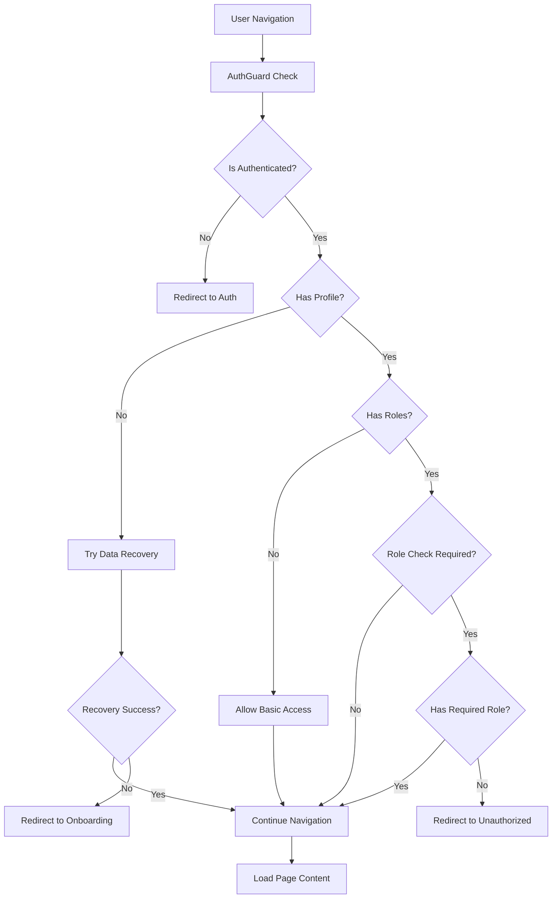

# Design Document

## Overview

O sistema de navegação e autenticação apresenta problemas críticos que causam expulsão de usuários durante a navegação pelo sidebar. A solução envolve otimizar o fluxo de autenticação, melhorar o gerenciamento de estado, implementar cache inteligente e corrigir a lógica de verificação de roles no AuthGuard.

## Architecture

### Current Issues Identified

1. **AuthGuard Over-Aggressive**: O AuthGuard está fazendo verificações muito restritivas que causam redirecionamentos desnecessários
2. **Race Conditions**: Carregamento de perfil e roles acontece de forma assíncrona causando estados inconsistentes
3. **Lack of State Persistence**: Estado de autenticação não é persistido adequadamente entre navegações
4. **Inefficient Re-fetching**: Dados são recarregados desnecessariamente a cada navegação

### Proposed Architecture



## Components and Interfaces

### 1. Enhanced AuthContext

**Improvements:**
- Add state caching mechanism
- Implement retry logic with exponential backoff
- Add loading states for different operations
- Implement optimistic updates

**New Interface:**
```typescript
interface AuthContextType {
  // Existing properties...
  
  // New properties for better state management
  isProfileLoading: boolean;
  isRolesLoading: boolean;
  lastProfileFetch: number;
  lastRolesFetch: number;
  authCache: AuthCache;
  
  // New methods
  refreshUserData: (force?: boolean) => Promise<void>;
  clearAuthCache: () => void;
  getAuthState: () => AuthState;
}

interface AuthCache {
  profile: { data: UserProfile | null; timestamp: number; };
  roles: { data: UserRoleContext[]; timestamp: number; };
  ttl: number; // Time to live in milliseconds
}

interface AuthState {
  isReady: boolean;
  hasValidSession: boolean;
  hasProfile: boolean;
  hasRoles: boolean;
  needsOnboarding: boolean;
}
```

### 2. Optimized AuthGuard

**Key Changes:**
- Implement grace periods for data loading
- Add intelligent caching
- Reduce unnecessary redirects
- Better error handling

**New Logic Flow:**
1. Check authentication status from cache first
2. If cache is stale, refresh data with timeout
3. Use progressive loading (allow basic access while roles load)
4. Implement fallback mechanisms for network issues

### 3. Navigation State Manager

**New Component:**
```typescript
interface NavigationStateManager {
  currentRoute: string;
  previousRoute: string;
  navigationHistory: string[];
  isNavigating: boolean;
  
  setNavigating: (navigating: boolean) => void;
  recordNavigation: (route: string) => void;
  canNavigateBack: () => boolean;
}
```

### 4. Enhanced Sidebar Component

**Improvements:**
- Add loading states for menu items
- Implement progressive disclosure
- Add error boundaries
- Cache role-based menu filtering

## Data Models

### AuthCache Model
```typescript
interface AuthCacheEntry<T> {
  data: T;
  timestamp: number;
  isStale: boolean;
  error?: string;
}

interface AuthCache {
  profile: AuthCacheEntry<UserProfile | null>;
  roles: AuthCacheEntry<UserRoleContext[]>;
  permissions: AuthCacheEntry<string[]>;
  ttl: number;
}
```

### Navigation State Model
```typescript
interface NavigationState {
  currentPath: string;
  isLoading: boolean;
  error?: string;
  retryCount: number;
  lastSuccessfulNavigation: string;
}
```

## Error Handling

### 1. Graceful Degradation Strategy

- **Level 1**: Full functionality with all data loaded
- **Level 2**: Basic functionality with profile but no roles
- **Level 3**: Limited functionality with session only
- **Level 4**: Redirect to authentication

### 2. Retry Mechanisms

```typescript
interface RetryConfig {
  maxRetries: number;
  baseDelay: number;
  maxDelay: number;
  backoffMultiplier: number;
}

const defaultRetryConfig: RetryConfig = {
  maxRetries: 3,
  baseDelay: 1000,
  maxDelay: 5000,
  backoffMultiplier: 2
};
```

### 3. Error Recovery Flows

1. **Profile Loading Failure**: Try data recovery → Fallback to basic access → Redirect to onboarding
2. **Role Loading Failure**: Allow basic dashboard access → Show limited menu → Background retry
3. **Network Errors**: Show cached data → Retry with backoff → Show offline mode
4. **Permission Errors**: Log detailed error → Show appropriate message → Redirect to safe route

## Testing Strategy

### 1. Unit Tests

- AuthContext state management
- AuthGuard logic with various scenarios
- Cache mechanisms
- Retry logic
- Data recovery functions

### 2. Integration Tests

- Complete authentication flows
- Navigation between protected routes
- Role-based access control
- Error recovery scenarios
- Cache invalidation

### 3. E2E Tests

- User login and navigation flows
- Sidebar navigation with different roles
- Network failure scenarios
- Session expiration handling
- Onboarding completion flows

### 4. Performance Tests

- Navigation speed benchmarks
- Cache hit/miss ratios
- Memory usage monitoring
- Network request optimization

## Implementation Phases

### Phase 1: Core Fixes
- Fix AuthGuard over-aggressive checks
- Implement basic caching
- Add proper loading states
- Fix race conditions

### Phase 2: Enhanced State Management
- Implement comprehensive caching
- Add retry mechanisms
- Optimize data fetching
- Add navigation state management

### Phase 3: Advanced Features
- Add offline support
- Implement predictive loading
- Add performance monitoring
- Enhanced error reporting

### Phase 4: Optimization
- Performance tuning
- Cache optimization
- Bundle size optimization
- Accessibility improvements

## Security Considerations

1. **Cache Security**: Ensure sensitive data is not persisted in insecure storage
2. **Token Management**: Implement secure token refresh mechanisms
3. **Role Validation**: Server-side validation for all role-based operations
4. **Audit Logging**: Log all authentication and authorization events
5. **Session Management**: Proper session timeout and cleanup

## Performance Optimizations

1. **Lazy Loading**: Load route components only when needed
2. **Code Splitting**: Split authentication logic into separate bundles
3. **Memoization**: Cache expensive computations and API calls
4. **Debouncing**: Prevent rapid successive API calls
5. **Preloading**: Preload likely next routes based on user role

## Monitoring and Debugging

1. **Enhanced Logging**: Structured logging with correlation IDs
2. **Performance Metrics**: Track navigation times and success rates
3. **Error Tracking**: Comprehensive error reporting with context
4. **User Analytics**: Track user navigation patterns
5. **Health Checks**: Automated authentication health monitoring