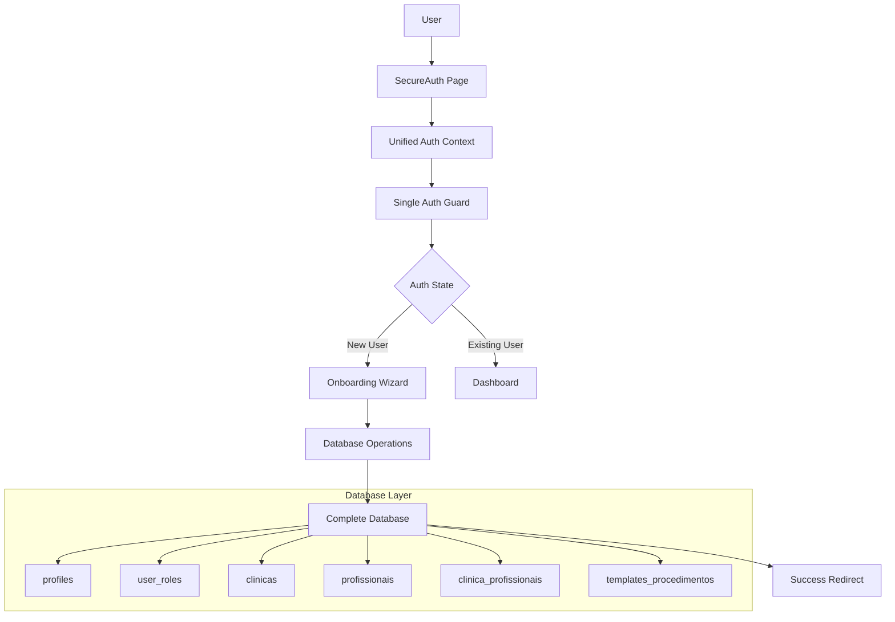

# Design Document

## Overview

Este documento detalha o design da solução para corrigir completamente o sistema de autenticação e onboarding do SaaS de clínicas estéticas. A solução elimina race conditions, loops infinitos, e problemas de performance através de uma arquitetura unificada, determinística e robusta.

## Architecture

### Princípios Arquiteturais

1. **Single Source of Truth**: Um único contexto de autenticação controlando todo o estado
2. **Deterministic Flow**: Lógica de redirecionamento previsível e sem ambiguidades  
3. **Fail-Fast**: Detecção rápida de problemas com recovery automático
4. **Performance-First**: Operações otimizadas com cache inteligente
5. **Database-Complete**: Estrutura completa do banco antes de qualquer operação

### Componentes Principais



## Components and Interfaces

### 1. Unified Authentication System

#### AuthContext Consolidation
- **Remove**: `AuthContext.tsx` (legacy)
- **Keep**: `SecureAuthContext.tsx` (enhanced)
- **Enhance**: Single state management with deterministic transitions

```typescript
interface UnifiedAuthState {
  // Core authentication
  isAuthenticated: boolean;
  user: User | null;
  profile: UserProfile | null;
  
  // Onboarding state
  onboardingStatus: 'not_started' | 'in_progress' | 'completed';
  
  // Loading states (granular)
  isInitializing: boolean;
  isProfileLoading: boolean;
  isOnboardingLoading: boolean;
  
  // Error handling
  error: AuthError | null;
  canRetry: boolean;
}
```

#### Single Auth Guard
- **Remove**: `AuthGuard.tsx`, `FastAuthGuard.tsx`, `SimpleAuthGuard.tsx`
- **Create**: `UnifiedAuthGuard.tsx` with deterministic logic

```typescript
interface AuthDecision {
  action: 'ALLOW' | 'REDIRECT' | 'LOADING' | 'ERROR';
  redirectTo?: string;
  reason?: string;
  canRetry?: boolean;
}
```

### 2. Database Schema Completion

#### Missing Tables Creation
```sql
-- clinica_profissionais (CRITICAL - missing)
CREATE TABLE public.clinica_profissionais (
  id UUID PRIMARY KEY DEFAULT gen_random_uuid(),
  clinica_id UUID NOT NULL REFERENCES public.clinicas(id),
  user_id UUID NOT NULL REFERENCES auth.users(id),
  cargo TEXT NOT NULL DEFAULT 'Proprietário',
  especialidades TEXT[],
  pode_criar_prontuarios BOOLEAN DEFAULT true,
  pode_editar_prontuarios BOOLEAN DEFAULT true,
  pode_visualizar_financeiro BOOLEAN DEFAULT true,
  ativo BOOLEAN DEFAULT true,
  criado_em TIMESTAMPTZ DEFAULT now(),
  UNIQUE(clinica_id, user_id)
);

-- templates_procedimentos (CRITICAL - missing)
CREATE TABLE public.templates_procedimentos (
  id UUID PRIMARY KEY DEFAULT gen_random_uuid(),
  tipo_procedimento tipo_procedimento NOT NULL,
  nome_template TEXT NOT NULL,
  descricao TEXT,
  duracao_padrao_minutos INTEGER DEFAULT 60,
  valor_base DECIMAL(10,2),
  campos_obrigatorios JSONB DEFAULT '{}',
  campos_opcionais JSONB DEFAULT '{}',
  ativo BOOLEAN DEFAULT true,
  criado_em TIMESTAMPTZ DEFAULT now(),
  criado_por UUID REFERENCES auth.users(id)
);
```

#### RLS Policies Optimization
```sql
-- Permissive policies for onboarding (temporary)
CREATE POLICY "onboarding_permissive_user_roles" ON user_roles
FOR ALL USING (auth.uid() = user_id);

CREATE POLICY "onboarding_permissive_clinicas" ON clinicas  
FOR ALL USING (true) WITH CHECK (true);

CREATE POLICY "onboarding_permissive_clinica_profissionais" ON clinica_profissionais
FOR ALL USING (auth.uid() = user_id);
```

### 3. Onboarding Wizard Enhancement

#### State Machine Design
```typescript
type OnboardingStep = 
  | 'personal_data'
  | 'clinic_setup' 
  | 'professional_setup'
  | 'service_setup'
  | 'configuration'
  | 'completion';

interface OnboardingState {
  currentStep: OnboardingStep;
  data: OnboardingData;
  isLoading: boolean;
  error: string | null;
  canProceed: boolean;
  validationErrors: Record<string, string>;
}
```

#### Atomic Operations
```typescript
interface OnboardingTransaction {
  createProfile(): Promise<void>;
  createRole(): Promise<void>;
  createClinic(): Promise<string>; // returns clinicId
  updateRoleWithClinic(clinicId: string): Promise<void>;
  createProfessional(): Promise<void>;
  linkProfessionalToClinic(clinicId: string): Promise<void>;
  createTemplate(): Promise<void>;
  markOnboardingComplete(): Promise<void>;
}
```

## Data Models

### Enhanced User Profile
```typescript
interface UserProfile {
  id: string;
  email: string;
  nome_completo: string;
  telefone?: string;
  avatar_url?: string;
  
  // Onboarding control
  primeiro_acesso: boolean;
  onboarding_step?: OnboardingStep;
  onboarding_completed_at?: Date;
  
  // Status
  ativo: boolean;
  criado_em: Date;
  atualizado_em: Date;
}
```

### Clinic Professional Relationship
```typescript
interface ClinicaProfissional {
  id: string;
  clinica_id: string;
  user_id: string;
  cargo: string;
  especialidades: string[];
  
  // Permissions
  pode_criar_prontuarios: boolean;
  pode_editar_prontuarios: boolean;
  pode_visualizar_financeiro: boolean;
  
  // Status
  ativo: boolean;
  criado_em: Date;
}
```

### Procedure Template
```typescript
interface TemplateProcedimento {
  id: string;
  tipo_procedimento: TipoProcedimento;
  nome_template: string;
  descricao?: string;
  
  // Configuration
  duracao_padrao_minutos: number;
  valor_base: number;
  campos_obrigatorios: Record<string, any>;
  campos_opcionais: Record<string, any>;
  
  // Status
  ativo: boolean;
  criado_em: Date;
  criado_por: string;
}
```

## Error Handling

### Error Classification
```typescript
enum AuthErrorType {
  AUTHENTICATION = 'authentication',
  AUTHORIZATION = 'authorization', 
  VALIDATION = 'validation',
  DATABASE = 'database',
  NETWORK = 'network',
  TIMEOUT = 'timeout'
}

interface AuthError {
  type: AuthErrorType;
  message: string;
  code?: string;
  recoverable: boolean;
  retryAfter?: number;
  context?: Record<string, any>;
}
```

### Recovery Strategies
```typescript
interface RecoveryStrategy {
  canRecover(error: AuthError): boolean;
  recover(error: AuthError): Promise<boolean>;
  maxAttempts: number;
  backoffMs: number;
}

// Strategies:
// - DatabaseRecovery: Create missing tables/data
// - AuthRecovery: Refresh tokens, re-authenticate
// - ValidationRecovery: Fix data format issues
// - NetworkRecovery: Retry with exponential backoff
```

### Error Boundaries
```typescript
interface AuthErrorBoundary {
  fallback: React.ComponentType<{error: AuthError}>;
  onError: (error: AuthError) => void;
  recovery: RecoveryStrategy[];
}
```

## Testing Strategy

### Unit Tests
- **AuthContext**: State transitions, error handling
- **AuthGuard**: Decision logic, redirection rules
- **OnboardingWizard**: Step validation, data persistence
- **Database Operations**: CRUD operations, RLS policies

### Integration Tests
- **Complete Onboarding Flow**: End-to-end user journey
- **Error Recovery**: Simulated failures and recovery
- **Performance**: Load testing, timeout scenarios
- **Database Consistency**: Data integrity validation

### E2E Tests
```typescript
describe('Complete User Journey', () => {
  test('New user signup to dashboard', async () => {
    // 1. User signs up
    // 2. Completes onboarding
    // 3. Reaches dashboard
    // 4. Can navigate freely
    // Expected: < 30 seconds total
  });
  
  test('Existing user login', async () => {
    // 1. User logs in
    // 2. Reaches dashboard directly
    // Expected: < 3 seconds total
  });
});
```

### Performance Benchmarks
- **Login Time**: < 3 seconds (target: 1-2 seconds)
- **Onboarding Completion**: < 30 seconds
- **Database Operations**: < 500ms each
- **Memory Usage**: < 50MB for auth context
- **Network Requests**: < 5 requests per login

## Security Considerations

### RLS Policy Strategy
1. **Phase 1**: Permissive policies for onboarding (temporary)
2. **Phase 2**: Restrictive policies after system stabilization
3. **Phase 3**: Fine-grained permissions per role

### Data Protection
- **Encryption**: All sensitive data encrypted at rest
- **Audit Trail**: All auth operations logged
- **Session Management**: Secure token handling
- **LGPD Compliance**: Data minimization and consent

### Attack Prevention
- **Rate Limiting**: Login attempts, API calls
- **Input Validation**: All user inputs sanitized
- **SQL Injection**: Parameterized queries only
- **XSS Prevention**: Content Security Policy

## Performance Optimizations

### Caching Strategy
```typescript
interface AuthCache {
  profile: CacheEntry<UserProfile>;
  roles: CacheEntry<UserRole[]>;
  clinics: CacheEntry<Clinic[]>;
  
  // TTL: 5 minutes (reduced from 10)
  // Invalidation: On auth state change
}
```

### Database Optimizations
- **Connection Pooling**: Supabase built-in
- **Query Optimization**: Indexed columns, efficient joins
- **Batch Operations**: Group related operations
- **Lazy Loading**: Load data only when needed

### Network Optimizations
- **Request Deduplication**: Prevent duplicate calls
- **Compression**: Gzip responses
- **CDN**: Static assets cached
- **Prefetching**: Predictive data loading

## Migration Strategy

### Phase 1: Database Preparation (Day 1)
1. Create missing tables
2. Update RLS policies
3. Verify data integrity
4. Performance testing

### Phase 2: Code Deployment (Day 2-3)
1. Deploy unified auth system
2. Feature flag activation
3. Monitor error rates
4. Gradual rollout

### Phase 3: Optimization (Day 4-7)
1. Performance tuning
2. Error rate analysis
3. User feedback integration
4. Documentation update

### Rollback Plan
- **Feature Flag**: Instant rollback capability
- **Database Backup**: Pre-migration snapshot
- **Code Rollback**: Previous version ready
- **Monitoring**: Real-time error detection