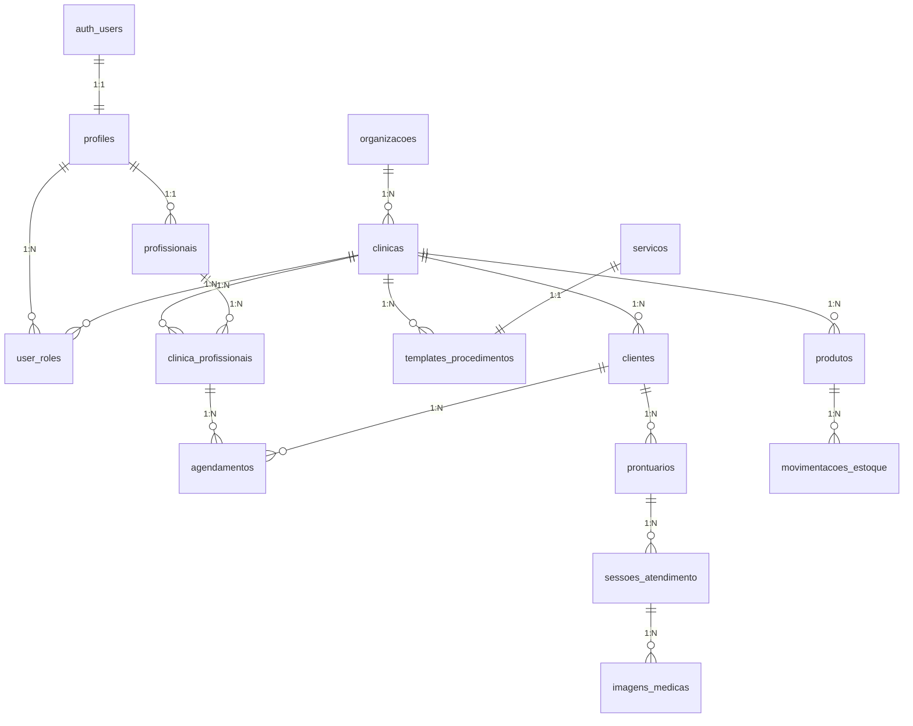
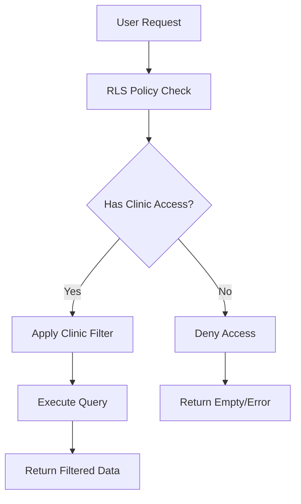

# Design Document - Sistema Completo de Clínicas de Estética

## Overview

Este documento apresenta o design técnico para completar a implementação do sistema SaaS multi-tenant para clínicas de estética. O design foca na criação das tabelas faltantes identificadas na análise, suas integrações e a implementação de funcionalidades core que estão ausentes no sistema atual.

### Situação Atual Identificada

**Tabelas Existentes:**
- ✅ `clinicas` - Dados básicos das clínicas
- ✅ `user_roles` - Sistema de permissões
- ✅ `organizacoes` - Estrutura organizacional
- ✅ `servicos` - Catálogo de serviços
- ✅ `clientes` - Dados dos clientes
- ✅ `agendamentos` - Sistema de agendamentos

**Tabelas Faltantes Críticas:**
- ❌ `profiles` - Perfis de usuários (erro no cache do Supabase)
- ❌ `profissionais` - Dados detalhados dos profissionais
- ❌ `clinica_profissionais` - Vínculo many-to-many clínicas-profissionais
- ❌ `templates_procedimentos` - Templates padronizados
- ❌ `produtos` - Gestão de estoque
- ❌ `prontuarios` - Prontuários digitais
- ❌ `sessoes_atendimento` - Registros de procedimentos
- ❌ `imagens_medicas` - Fotos antes/depois
- ❌ `movimentacoes_estoque` - Controle de estoque
- ❌ `relatorios_financeiros` - Dados financeiros

## Architecture

### Database Schema Architecture



### Multi-Tenant Security Model



## Components and Interfaces

### 1. Professional Management Component

**Tabela: `profissionais`**
```sql
CREATE TABLE public.profissionais (
    id UUID PRIMARY KEY DEFAULT gen_random_uuid(),
    user_id UUID NOT NULL REFERENCES auth.users(id),
    nome_completo TEXT NOT NULL,
    cpf TEXT,
    registro_profissional TEXT,
    conselho_profissional TEXT,
    especialidades especialidade_medica[],
    telefone TEXT,
    email TEXT,
    endereco JSONB,
    formacao TEXT[],
    certificacoes TEXT[],
    experiencia_anos INTEGER,
    biografia TEXT,
    disponivel_agenda BOOLEAN DEFAULT true,
    valor_consulta DECIMAL(10,2),
    duracao_consulta_padrao INTEGER DEFAULT 60,
    ativo BOOLEAN DEFAULT true,
    verificado BOOLEAN DEFAULT false,
    criado_em TIMESTAMPTZ DEFAULT now(),
    atualizado_em TIMESTAMPTZ DEFAULT now()
);
```

**Tabela: `clinica_profissionais`**
```sql
CREATE TABLE public.clinica_profissionais (
    id UUID PRIMARY KEY DEFAULT gen_random_uuid(),
    clinica_id UUID NOT NULL REFERENCES clinicas(id),
    user_id UUID NOT NULL REFERENCES auth.users(id),
    cargo TEXT DEFAULT 'Profissional',
    especialidades especialidade_medica[],
    pode_criar_prontuarios BOOLEAN DEFAULT true,
    pode_editar_prontuarios BOOLEAN DEFAULT true,
    pode_visualizar_financeiro BOOLEAN DEFAULT false,
    pode_gerenciar_agenda BOOLEAN DEFAULT true,
    pode_acessar_estoque BOOLEAN DEFAULT false,
    valor_consulta_clinica DECIMAL(10,2),
    percentual_comissao DECIMAL(5,2),
    horario_trabalho JSONB,
    ativo BOOLEAN DEFAULT true,
    data_inicio DATE DEFAULT CURRENT_DATE,
    data_fim DATE,
    criado_em TIMESTAMPTZ DEFAULT now()
);
```

### 2. Procedure Templates Component

**Tabela: `templates_procedimentos`**
```sql
CREATE TABLE public.templates_procedimentos (
    id UUID PRIMARY KEY DEFAULT gen_random_uuid(),
    clinica_id UUID REFERENCES clinicas(id),
    tipo_procedimento tipo_procedimento NOT NULL,
    nome_template TEXT NOT NULL,
    descricao TEXT,
    duracao_padrao_minutos INTEGER DEFAULT 60,
    valor_base DECIMAL(10,2),
    campos_obrigatorios JSONB DEFAULT '{}',
    campos_opcionais JSONB DEFAULT '{}',
    instrucoes_pre_procedimento TEXT,
    instrucoes_pos_procedimento TEXT,
    contraindicacoes TEXT[],
    materiais_necessarios TEXT[],
    permite_agendamento_online BOOLEAN DEFAULT true,
    requer_avaliacao_previa BOOLEAN DEFAULT false,
    intervalo_minimo_dias INTEGER DEFAULT 0,
    ativo BOOLEAN DEFAULT true,
    publico BOOLEAN DEFAULT false,
    criado_em TIMESTAMPTZ DEFAULT now(),
    criado_por UUID NOT NULL REFERENCES auth.users(id)
);
```

### 3. Inventory Management Component

**Tabela: `produtos`**
```sql
CREATE TABLE public.produtos (
    id UUID PRIMARY KEY DEFAULT gen_random_uuid(),
    clinica_id UUID NOT NULL REFERENCES clinicas(id),
    nome TEXT NOT NULL,
    marca TEXT,
    categoria categoria_produto NOT NULL,
    fornecedor_id UUID REFERENCES fornecedores(id),
    preco_custo DECIMAL(10,2) NOT NULL,
    preco_venda DECIMAL(10,2),
    quantidade INTEGER NOT NULL DEFAULT 0,
    unidade_medida unidade_medida NOT NULL,
    estoque_minimo INTEGER DEFAULT 0,
    estoque_maximo INTEGER,
    data_vencimento DATE,
    lote TEXT,
    codigo_barras TEXT,
    localizacao TEXT,
    status status_produto DEFAULT 'disponivel',
    descricao TEXT,
    indicacoes TEXT[],
    contraindicacoes TEXT[],
    modo_uso TEXT,
    composicao TEXT,
    registro_anvisa TEXT,
    imagem_url TEXT,
    ativo BOOLEAN DEFAULT true,
    criado_em TIMESTAMPTZ DEFAULT now(),
    atualizado_em TIMESTAMPTZ DEFAULT now(),
    criado_por UUID REFERENCES auth.users(id)
);
```

**Tabela: `movimentacoes_estoque`**
```sql
CREATE TABLE public.movimentacoes_estoque (
    id UUID PRIMARY KEY DEFAULT gen_random_uuid(),
    produto_id UUID NOT NULL REFERENCES produtos(id),
    tipo_movimentacao tipo_movimentacao NOT NULL,
    quantidade INTEGER NOT NULL,
    quantidade_anterior INTEGER NOT NULL,
    quantidade_atual INTEGER NOT NULL,
    valor_unitario DECIMAL(10,2),
    valor_total DECIMAL(10,2),
    motivo TEXT,
    observacoes TEXT,
    responsavel_id UUID NOT NULL REFERENCES auth.users(id),
    cliente_id UUID REFERENCES clientes(id),
    servico_id UUID REFERENCES servicos(id),
    sessao_atendimento_id UUID REFERENCES sessoes_atendimento(id),
    lote TEXT,
    data_movimentacao TIMESTAMPTZ DEFAULT now(),
    criado_em TIMESTAMPTZ DEFAULT now()
);
```

### 4. Digital Medical Records Component

**Tabela: `prontuarios`**
```sql
CREATE TABLE public.prontuarios (
    id UUID PRIMARY KEY DEFAULT gen_random_uuid(),
    cliente_id UUID NOT NULL REFERENCES clientes(id),
    clinica_id UUID NOT NULL REFERENCES clinicas(id),
    medico_responsavel_id UUID NOT NULL REFERENCES auth.users(id),
    numero_prontuario TEXT NOT NULL,
    status status_prontuario DEFAULT 'ativo',
    
    -- Dados médicos criptografados
    anamnese_criptografada TEXT,
    historico_medico_criptografado TEXT,
    medicamentos_atuais_criptografado TEXT,
    alergias_criptografado TEXT,
    contraindicacoes_criptografado TEXT,
    
    -- Metadados de auditoria
    criado_em TIMESTAMPTZ DEFAULT now(),
    atualizado_em TIMESTAMPTZ DEFAULT now(),
    criado_por UUID NOT NULL REFERENCES auth.users(id),
    atualizado_por UUID REFERENCES auth.users(id),
    versao INTEGER DEFAULT 1,
    hash_integridade TEXT NOT NULL,
    
    UNIQUE(clinica_id, numero_prontuario)
);
```

**Tabela: `sessoes_atendimento`**
```sql
CREATE TABLE public.sessoes_atendimento (
    id UUID PRIMARY KEY DEFAULT gen_random_uuid(),
    prontuario_id UUID NOT NULL REFERENCES prontuarios(id),
    agendamento_id UUID REFERENCES agendamentos(id),
    tipo_procedimento tipo_procedimento NOT NULL,
    template_id UUID REFERENCES templates_procedimentos(id),
    data_atendimento TIMESTAMPTZ NOT NULL,
    profissional_id UUID NOT NULL REFERENCES auth.users(id),
    
    -- Dados do procedimento
    procedimento_detalhes JSONB DEFAULT '{}',
    produtos_utilizados JSONB DEFAULT '[]',
    equipamentos_utilizados TEXT[],
    parametros_tecnicos JSONB DEFAULT '{}',
    
    -- Observações médicas
    observacoes_pre TEXT,
    observacoes_pos TEXT,
    intercorrencias TEXT,
    orientacoes_paciente TEXT,
    
    -- Resultados e evolução
    resultados_imediatos TEXT,
    satisfacao_paciente INTEGER CHECK (satisfacao_paciente >= 1 AND satisfacao_paciente <= 10),
    proxima_sessao_recomendada DATE,
    
    -- Valores
    valor_procedimento DECIMAL(10,2),
    valor_produtos DECIMAL(10,2),
    valor_total DECIMAL(10,2),
    
    -- Auditoria
    criado_em TIMESTAMPTZ DEFAULT now(),
    criado_por UUID NOT NULL REFERENCES auth.users(id),
    hash_integridade TEXT NOT NULL
);
```

### 5. Medical Imaging Component

**Tabela: `imagens_medicas`**
```sql
CREATE TABLE public.imagens_medicas (
    id UUID PRIMARY KEY DEFAULT gen_random_uuid(),
    sessao_id UUID NOT NULL REFERENCES sessoes_atendimento(id),
    tipo_imagem tipo_imagem NOT NULL,
    
    -- Dados da imagem criptografados
    url_criptografada TEXT NOT NULL,
    nome_arquivo_original TEXT NOT NULL,
    tamanho_bytes BIGINT NOT NULL,
    mime_type TEXT NOT NULL,
    resolucao TEXT,
    
    -- Metadados médicos
    regiao_corporal TEXT NOT NULL,
    angulo_captura TEXT,
    condicoes_iluminacao TEXT,
    observacoes_imagem TEXT,
    
    -- Controle de acesso
    visivel_paciente BOOLEAN DEFAULT false,
    watermark_aplicado BOOLEAN DEFAULT true,
    
    -- Auditoria
    capturada_em TIMESTAMPTZ DEFAULT now(),
    capturada_por UUID NOT NULL REFERENCES auth.users(id),
    hash_imagem TEXT NOT NULL,
    
    -- Metadados de armazenamento
    bucket_storage TEXT,
    path_storage TEXT,
    backup_url TEXT
);
```

## Data Models

### Core Enums

```sql
-- Tipos de procedimentos estéticos
CREATE TYPE tipo_procedimento AS ENUM (
    'botox_toxina',
    'preenchimento',
    'harmonizacao_facial',
    'laser_ipl',
    'peeling',
    'tratamento_corporal',
    'skincare_avancado',
    'microagulhamento',
    'radiofrequencia',
    'criolipólise',
    'outro'
);

-- Especialidades médicas
CREATE TYPE especialidade_medica AS ENUM (
    'dermatologia',
    'cirurgia_plastica',
    'medicina_estetica',
    'fisioterapia_dermatofuncional',
    'biomedicina_estetica',
    'enfermagem_estetica',
    'esteticista',
    'outro'
);

-- Categorias de produtos
CREATE TYPE categoria_produto AS ENUM (
    'cremes',
    'seruns',
    'descartaveis',
    'anestesicos',
    'limpeza',
    'equipamentos_consumo',
    'medicamentos',
    'cosmeticos',
    'suplementos',
    'injetaveis'
);

-- Status de produtos
CREATE TYPE status_produto AS ENUM (
    'disponivel',
    'baixo_estoque',
    'vencido',
    'descontinuado',
    'em_falta'
);

-- Tipos de movimentação de estoque
CREATE TYPE tipo_movimentacao AS ENUM (
    'entrada',
    'saida',
    'ajuste',
    'vencimento',
    'perda',
    'transferencia'
);

-- Unidades de medida
CREATE TYPE unidade_medida AS ENUM (
    'ml',
    'g',
    'unidade',
    'caixa',
    'frasco',
    'tubo',
    'ampola',
    'seringa'
);

-- Status de prontuários
CREATE TYPE status_prontuario AS ENUM (
    'ativo',
    'arquivado',
    'transferido'
);

-- Tipos de imagens médicas
CREATE TYPE tipo_imagem AS ENUM (
    'antes',
    'durante',
    'depois',
    'evolucao'
);
```

### Integration Models

```typescript
// Modelo de integração para profissionais
interface ProfessionalIntegration {
  user: UserProfile;
  professional: ProfessionalData;
  clinicLinks: ClinicProfessionalLink[];
  specialties: MedicalSpecialty[];
  availability: ScheduleAvailability;
}

// Modelo de integração para procedimentos
interface ProcedureIntegration {
  template: ProcedureTemplate;
  session: AttendanceSession;
  products: ProductUsage[];
  images: MedicalImage[];
  billing: BillingData;
}

// Modelo de integração para estoque
interface InventoryIntegration {
  product: Product;
  movements: StockMovement[];
  alerts: StockAlert[];
  suppliers: Supplier[];
}
```

## Error Handling

### Database Error Recovery

```sql
-- Função para recuperação de integridade
CREATE OR REPLACE FUNCTION public.repair_data_integrity()
RETURNS JSONB AS $$
DECLARE
    result JSONB := '{}';
    missing_profiles INTEGER := 0;
    orphaned_roles INTEGER := 0;
    missing_links INTEGER := 0;
BEGIN
    -- Reparar profiles faltantes
    INSERT INTO public.profiles (id, email, nome_completo)
    SELECT u.id, u.email, COALESCE(u.raw_user_meta_data->>'nome_completo', u.email)
    FROM auth.users u
    LEFT JOIN public.profiles p ON p.id = u.id
    WHERE p.id IS NULL;
    
    GET DIAGNOSTICS missing_profiles = ROW_COUNT;
    
    -- Limpar roles órfãos
    DELETE FROM public.user_roles ur
    WHERE NOT EXISTS (
        SELECT 1 FROM auth.users u WHERE u.id = ur.user_id
    );
    
    GET DIAGNOSTICS orphaned_roles = ROW_COUNT;
    
    -- Criar vínculos profissionais faltantes
    INSERT INTO public.clinica_profissionais (clinica_id, user_id, criado_por)
    SELECT ur.clinica_id, ur.user_id, ur.user_id
    FROM public.user_roles ur
    LEFT JOIN public.clinica_profissionais cp ON cp.clinica_id = ur.clinica_id AND cp.user_id = ur.user_id
    WHERE ur.role = 'profissionais' 
    AND ur.clinica_id IS NOT NULL 
    AND cp.id IS NULL;
    
    GET DIAGNOSTICS missing_links = ROW_COUNT;
    
    result := jsonb_build_object(
        'missing_profiles_created', missing_profiles,
        'orphaned_roles_removed', orphaned_roles,
        'missing_links_created', missing_links,
        'timestamp', now()
    );
    
    RETURN result;
END;
$$ LANGUAGE plpgsql SECURITY DEFINER;
```

### Application Error Handling

```typescript
// Service para recuperação de erros
export class DatabaseRecoveryService {
  async repairIntegrity(): Promise<IntegrityRepairResult> {
    try {
      const { data, error } = await supabase.rpc('repair_data_integrity');
      
      if (error) throw error;
      
      return {
        success: true,
        repairs: data,
        message: 'Database integrity repaired successfully'
      };
    } catch (error) {
      return {
        success: false,
        error: error.message,
        suggestions: [
          'Check database connectivity',
          'Verify RLS policies',
          'Contact system administrator'
        ]
      };
    }
  }
}
```

## Testing Strategy

### Database Testing

1. **Schema Validation Tests**
   - Verificar criação de todas as tabelas
   - Validar constraints e índices
   - Testar integridade referencial

2. **RLS Policy Tests**
   - Testar isolamento multi-tenant
   - Verificar permissões por role
   - Validar políticas de segurança

3. **Data Migration Tests**
   - Testar migração de dados existentes
   - Verificar preservação de integridade
   - Validar rollback procedures

### Integration Testing

1. **Professional Management Tests**
   - Criar profissional e vínculo com clínica
   - Testar múltiplos vínculos
   - Validar permissões específicas

2. **Procedure Template Tests**
   - Criar templates básicos
   - Testar uso em sessões
   - Validar versionamento

3. **Inventory Management Tests**
   - Cadastrar produtos
   - Testar movimentações
   - Validar alertas de estoque

### Performance Testing

1. **Query Performance**
   - Testar consultas com grandes volumes
   - Otimizar índices críticos
   - Monitorar tempos de resposta

2. **Multi-tenant Scalability**
   - Testar com múltiplas clínicas
   - Validar isolamento de dados
   - Monitorar uso de recursos

## Security Considerations

### Data Encryption

- Dados médicos sensíveis criptografados em repouso
- Chaves de criptografia gerenciadas pelo Supabase
- Auditoria completa de acessos a dados sensíveis

### Access Control

- RLS policies rigorosas por clínica
- Controle granular de permissões
- Logs de auditoria para compliance

### LGPD/HIPAA Compliance

- Consentimento digital rastreável
- Direito ao esquecimento implementado
- Portabilidade de dados garantida