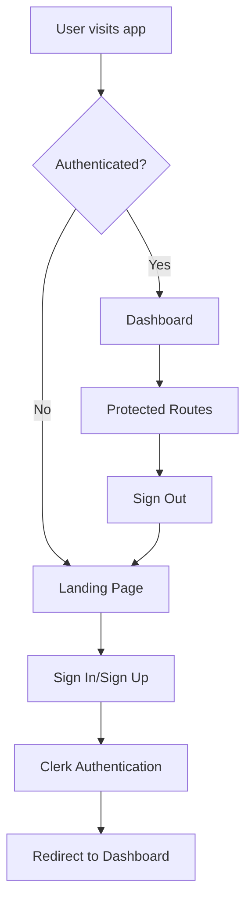

# 🔐 Clerk Authentication Setup Guide

## Overview

This application uses Clerk for authentication, providing secure user management, sign-in/sign-up flows, and session handling. This guide covers the complete setup and configuration process.

## Prerequisites

- Node.js 18+ installed
- A Clerk account (free tier available)
- Basic understanding of React and environment variables

## 1. Clerk Account Setup

### Create a Clerk Application

1. Go to [clerk.com](https://clerk.com) and create an account
2. Create a new application in the Clerk Dashboard
3. Choose your preferred authentication methods (email/password, social logins, etc.)
4. Copy your **Publishable Key** from the API Keys section

### Configure Authentication Settings

In your Clerk Dashboard:

1. **Sign-in/Sign-up**: Configure allowed authentication methods
2. **Redirects**: Set up redirect URLs (optional, handled by the app)
3. **User Profile**: Configure required/optional user fields
4. **Sessions**: Configure session duration and security settings

## 2. Environment Configuration

### Create Environment File

Create a `.env.local` file in your project root:

```bash
# Clerk Authentication
VITE_CLERK_PUBLISHABLE_KEY=pk_test_your_publishable_key_here

# Other environment variables...
```

### Security Notes

- ✅ `.env.local` is already in `.gitignore` - never commit this file
- ✅ Use `VITE_` prefix for client-side environment variables
- ✅ Only use the **publishable key** (starts with `pk_`) in frontend code
- ❌ Never expose your **secret key** in frontend code

## 3. Application Architecture

### Authentication Flow



### Key Components

#### ClerkProvider (main.tsx)
- Wraps the entire application
- Provides authentication context
- Handles redirects and configuration

#### Route Protection
- `ProtectedRoute` component wraps authenticated routes
- `SignedIn`/`SignedOut` components for conditional rendering
- Automatic redirects for unauthenticated users

#### Authentication UI
- `SignInButton` and `SignUpButton` for unauthenticated users
- `UserButton` for authenticated users (profile, settings, sign out)
- Custom `LandingPage` for public content

## 4. Development Workflow

### Running the Application

```bash
# Install dependencies
npm install

# Start development server
npm run dev

# Run tests
npm test
```

### Testing Authentication

1. **Unauthenticated State**:
   - Visit `http://localhost:5173`
   - Should see landing page with sign-in/sign-up buttons
   - Cannot access protected routes like `/dashboard`

2. **Sign Up Flow**:
   - Click "Sign Up" button
   - Complete Clerk's sign-up process
   - Should redirect to `/dashboard` after successful registration

3. **Sign In Flow**:
   - Click "Sign In" button
   - Enter credentials
   - Should redirect to `/dashboard` after successful login

4. **Protected Routes**:
   - Access routes like `/dashboard`, `/clientes`, `/servicos`
   - Should work normally when authenticated
   - Should redirect to landing page when not authenticated

5. **Sign Out**:
   - Click user button in header
   - Select "Sign Out"
   - Should redirect to landing page

## 5. Customization Options

### Styling Authentication Components

Clerk components inherit your app's CSS. You can customize:

```css
/* Clerk component styling */
.cl-userButton-trigger {
  /* Custom user button styles */
}

.cl-signIn-root {
  /* Custom sign-in modal styles */
}
```

### Custom Authentication Pages

You can create custom sign-in/sign-up pages:

```typescript
// Custom sign-in page
import { SignIn } from '@clerk/clerk-react';

export function CustomSignInPage() {
  return (
    <div className="flex justify-center items-center min-h-screen">
      <SignIn 
        routing="path" 
        path="/sign-in"
        afterSignInUrl="/dashboard"
      />
    </div>
  );
}
```

### Additional Configuration

```typescript
// In main.tsx ClerkProvider
<ClerkProvider
  publishableKey={publishableKey}
  // Custom redirect URLs
  afterSignInUrl="/custom-dashboard"
  afterSignUpUrl="/onboarding"
  afterSignOutUrl="/goodbye"
  // Custom sign-in/up pages
  signInUrl="/custom-signin"
  signUpUrl="/custom-signup"
>
```

## 6. Error Handling

### Common Issues and Solutions

#### Missing Publishable Key
```
Error: VITE_CLERK_PUBLISHABLE_KEY is missing
```
**Solution**: Add the key to your `.env.local` file

#### Invalid Publishable Key
```
Error: Clerk publishable keys should start with "pk_"
```
**Solution**: Verify you're using the publishable key, not the secret key

#### Network Issues
The app includes retry logic for network failures. Users will see appropriate error messages and retry options.

#### Session Expiration
Sessions are automatically refreshed. If refresh fails, users are redirected to sign in.

## 7. Production Deployment

### Environment Variables

Set the following in your production environment:

```bash
VITE_CLERK_PUBLISHABLE_KEY=pk_live_your_production_key
```

### Domain Configuration

In Clerk Dashboard:
1. Add your production domain to allowed origins
2. Configure production redirect URLs
3. Update webhook endpoints if using webhooks

### Security Checklist

- ✅ Use production Clerk keys
- ✅ Configure proper CORS settings
- ✅ Set up proper redirect URLs
- ✅ Enable security features (2FA, etc.)
- ✅ Monitor authentication logs

## 8. Monitoring and Analytics

### Clerk Dashboard

Monitor your authentication metrics:
- User sign-ups and sign-ins
- Authentication method usage
- Session duration and activity
- Error rates and issues

### Application Logs

The app includes comprehensive logging:
- Authentication events
- Error tracking
- Performance metrics
- User activity

## 9. Migration Notes

### From Previous Authentication System

This application was migrated from a custom authentication system:

- ✅ `NoAuthProvider` removed
- ✅ Custom auth hooks replaced with `useClerkAuth`
- ✅ Route protection updated to use Clerk components
- ✅ Error handling enhanced with Clerk-specific logic
- ✅ All tests updated with Clerk mocks

### Compatibility

The `useClerkAuth` hook maintains compatibility with the previous authentication interface, ensuring minimal code changes were required during migration.

## 10. Support and Resources

### Documentation
- [Clerk Documentation](https://clerk.com/docs)
- [Clerk React SDK](https://clerk.com/docs/references/react/overview)
- [Authentication Best Practices](https://clerk.com/docs/authentication/overview)

### Community
- [Clerk Discord](https://clerk.com/discord)
- [GitHub Issues](https://github.com/clerkinc/javascript)
- [Stack Overflow](https://stackoverflow.com/questions/tagged/clerk)

### Troubleshooting

If you encounter issues:
1. Check the browser console for error messages
2. Verify environment variables are set correctly
3. Check Clerk Dashboard for authentication logs
4. Review this guide for common solutions
5. Contact support if issues persist

---

**Last Updated**: December 2024
**Clerk Version**: 5.47.0
**React Version**: 18.3.1