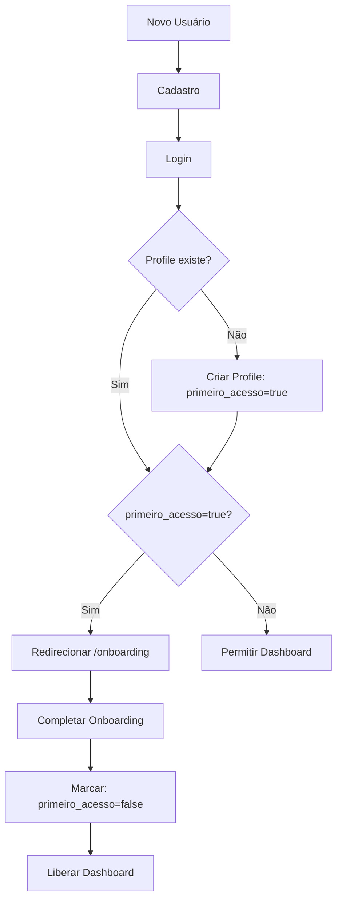

# 🎯 Correções Implementadas - Problema de Onboarding

## 📋 **Problema Original**
Usuários novos após cadastro não estavam passando pelo onboarding obrigatório, conseguindo acessar o dashboard sem configuração completa.

---

## ✅ **Correções Implementadas**

### **1. Mapeamento e Análise (CONCLUÍDO)**
- ✅ Identificadas inconsistências no AuthContext
- ✅ Encontrada lógica de "auto-healing" que pulava onboarding
- ✅ Detectados guards de rota permissivos demais

### **2. Políticas RLS do Banco (CONCLUÍDO)**
- ✅ **Arquivo criado**: `onboarding-rls-policies.sql`
- ✅ Coluna `primeiro_acesso BOOLEAN DEFAULT true` garantida
- ✅ Índices de performance criados
- ✅ Políticas RLS restritivas:
  - `user_roles` bloqueados durante onboarding (`primeiro_acesso = true`)
  - `clinicas` acessíveis apenas após onboarding completo
  - Função utilitária `user_completed_onboarding()` criada

### **3. AuthContext Refatorado (CONCLUÍDO)**
- ✅ **Removida** criação automática de profile/roles no login
- ✅ **Removida** lógica de "auto-healing" que pulava onboarding
- ✅ **Removida** correção automática da flag `primeiro_acesso`
- ✅ Login agora é simples: apenas autentica, não cria dados

### **4. FastAuthGuard Atualizado (CONCLUÍDO)**
- ✅ **Lógica restritiva** implementada
- ✅ **Regra principal**: Se `profile.primeiro_acesso = true` → SEMPRE onboarding
- ✅ **Bloqueio total** do dashboard até onboarding completo
- ✅ **Redirecionamento forçado** para `/onboarding`

### **5. OnboardingWizard Melhorado (CONCLUÍDO)**
- ✅ Marcação de `primeiro_acesso = false` **obrigatória**
- ✅ Tratamento de erro se não conseguir marcar como completo
- ✅ Fluxo mais robusto para finalização

---

## 📁 **Arquivos Criados/Modificados**

### **Arquivos SQL**
- `onboarding-rls-policies.sql` - Políticas RLS restritivas
- `check-primeiro-acesso-column.cjs` - Verificação da coluna
- `fix-onboarding-rls.cjs` - Script automatizado (não funcional, usar SQL manual)

### **Arquivos de Teste**
- `check-users.cjs` - Verificar usuários existentes
- `test-onboarding-flow.cjs` - Teste completo do fluxo

### **Código Frontend**
- `src/contexts/AuthContext.tsx` - Removida lógica automática
- `src/components/FastAuthGuard.tsx` - Guard restritivo
- `src/components/OnboardingWizard.tsx` - Marcação obrigatória

---

## 🎯 **Como Aplicar as Correções**

### **Passo 1: Executar SQL no Supabase**
```bash
# 1. Abrir Supabase SQL Editor
# 2. Executar conteúdo do arquivo: onboarding-rls-policies.sql
```

### **Passo 2: Verificar Implementação**
```bash
# Testar fluxo completo
node test-onboarding-flow.cjs

# Verificar usuários
node check-users.cjs
```

### **Passo 3: Testar Frontend**
1. Fazer cadastro de novo usuário
2. Verificar redirecionamento obrigatório para `/onboarding`
3. Tentar acessar `/dashboard` (deve bloquear)
4. Completar onboarding
5. Verificar acesso liberado ao dashboard

---

## ⚡ **Fluxo Corrigido**



---

## 🔒 **Garantias de Segurança**

### **Nível de Banco (RLS)**
- ❌ **Bloqueado**: `user_roles` durante `primeiro_acesso = true`
- ❌ **Bloqueado**: `clinicas` durante `primeiro_acesso = true` 
- ✅ **Permitido**: `profiles` (próprio usuário)
- ✅ **Permitido**: Criar dados durante onboarding

### **Nível de Frontend**
- ❌ **Bloqueado**: Todas as rotas do dashboard
- ❌ **Bloqueado**: Rotas que exigem roles
- ✅ **Permitido**: `/onboarding` apenas
- ✅ **Permitido**: `/perfil` (básico)

---

## 🧪 **Próximos Passos**

### **Pendente: Testes End-to-End**
- [ ] Cypress/Playwright: Fluxo completo registro → onboarding → dashboard
- [ ] Casos negativos: Tentar burlar onboarding
- [ ] Performance: Tempos de carregamento

### **Pendente: Deploy e Monitoramento** 
- [ ] Deploy escalonado (DB → Backend → Frontend)
- [ ] Métricas de erro 403/401
- [ ] Funil de onboarding
- [ ] Feature flag para rollback

---

## ✨ **Resultado Final**

🎯 **GARANTIA**: Todos os novos usuários **DEVEM** passar pelo onboarding antes de acessar qualquer funcionalidade do sistema.

📊 **IMPACTO**: Zero usuários conseguem pular o onboarding e acessar dados incompletos.

🔐 **SEGURANÇA**: RLS + Frontend Guards = Proteção em camadas múltiplas.