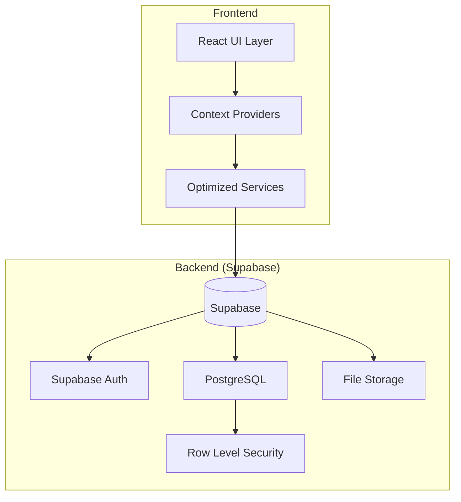
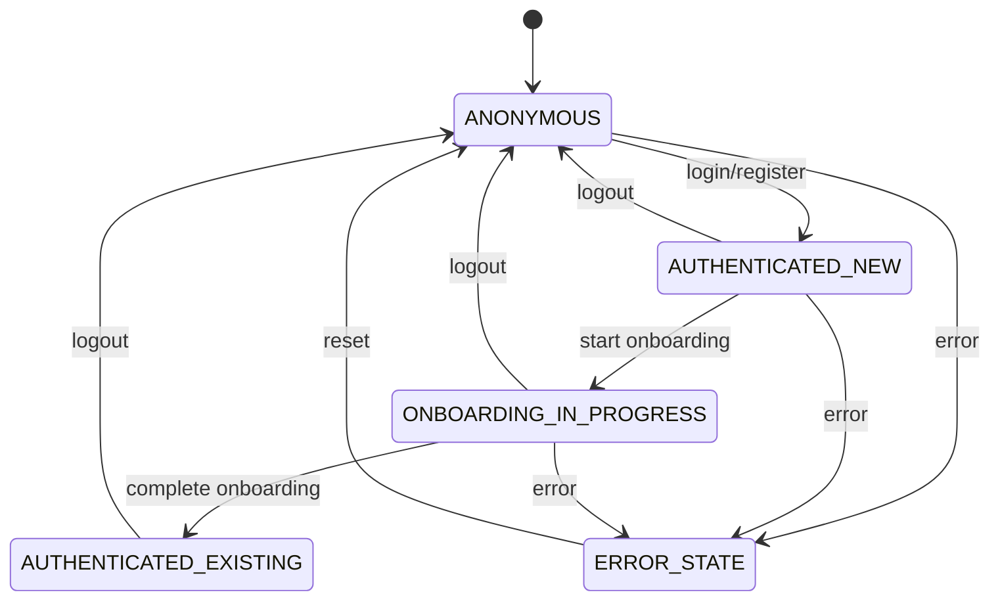

# WARP.md

Este arquivo fornece orientações ao WARP (warp.dev) ao trabalhar com código neste repositório.

## ✨ Visão Geral Rápida

O **Luxe Flow Appoint** é um sistema completo de gestão para clínicas estéticas que oferece funcionalidades como agendamentos, gerenciamento de clientes, controle de estoque, prontuários médicos e análise financeira. O sistema é multi-tenant, permitindo que múltiplas clínicas operem independentemente com suas próprias configurações, usuários e dados.

O projeto utiliza uma arquitetura moderna com React + TypeScript no frontend, Supabase como backend-as-a-service, sistema de autenticação robusto com diferentes níveis de acesso, e um complexo sistema de onboarding para novos usuários e clínicas.

## 🚀 Início Rápido

```bash
# Clonar o repositório
git clone <repository-url>
cd luxe-flow-appoint

# Configurar variáveis de ambiente
cp .env.example .env
# Preencher VITE_SUPABASE_URL, VITE_SUPABASE_ANON_KEY e SUPABASE_SERVICE_ROLE_KEY

# Instalar dependências
npm install

# Configurar banco de dados (se necessário)
npm run check:db

# Iniciar desenvolvimento
npm run dev
```

O servidor de desenvolvimento estará disponível em `http://localhost:5173`.

## 🔄 Comandos de Desenvolvimento

### Comandos Principais

| Comando | Descrição |
|---------|-----------|
| `npm run dev` | Inicia servidor Vite com HMR em `localhost:5173` |
| `npm run build` | Build de produção |
| `npm run build:dev` | Build em modo desenvolvimento |
| `npm run preview` | Preview do build em `localhost:5174` |
| `npm run lint` | Executa ESLint |
| `npm test` | Executa testes Jest |
| `npm run test:watch` | Testes em modo watch |
| `npm run test:coverage` | Testes com cobertura |

### Scripts de Banco de Dados

| Comando | Descrição |
|---------|-----------|
| `npm run check:db` | Verifica estrutura do banco |
| `npm run check:roles` | Verifica tabela de roles |
| `npm run create:roles` | Cria tabela de roles |
| `npm run check:profiles` | Verifica estrutura de perfis |
| `npm run fix:profiles` | Executa correções nos perfis |

### Scripts de Backup

| Comando | Descrição |
|---------|-----------|
| `npm run backup` | Backup completo do Supabase |
| `npm run backup:schema` | Backup apenas do schema |
| `npm run backup:data` | Backup apenas dos dados |
| `npm run restore` | Restaura backup |

### Scripts de Teste e Validação

| Comando | Descrição |
|---------|-----------|
| `npm run test:routes` | Testa rotas do servidor de desenvolvimento |
| `npm run test:auth` | Testa fluxo de autenticação |
| `npm run test:user` | Testa criação de usuário |
| `npm run test:policies` | Testa políticas de banco |
| `npm run validate:build` | Valida build de produção |

## 🏗️ Arquitetura de Alto Nível



### Camadas da Aplicação

1. **UI Layer**: Componentes React com shadcn/ui, roteamento com React Router
2. **State Management**: Context API com `UnifiedAuthContext` e `SecureAuthContext`
3. **Services**: Serviços otimizados com cache inteligente e batch operations
4. **Backend**: Supabase com RLS, functions e triggers automáticos

### Tecnologias Principais

- **Frontend**: React 18, TypeScript, Vite, TailwindCSS, shadcn/ui
- **Backend**: Supabase (PostgreSQL, Auth, Storage)
- **State**: Context API, TanStack Query
- **Testes**: Jest, Testing Library
- **Build**: Vite, ESBuild

## 🔐 Autenticação e Autorização

### Estados de Autenticação Determinísticos

O sistema utiliza uma máquina de estados bem definida para evitar race conditions:



### Contextos de Autenticação

| Contexto | Propósito | Localização |
|----------|-----------|-------------|
| `UnifiedAuthContext` | Sistema principal de autenticação V2 | `src/contexts/UnifiedAuthContext.tsx` |
| `SecureAuthContext` | Sistema legado com compatibilidade | `src/contexts/SecureAuthContext.tsx` |

### Serviços de Autenticação

- **`OptimizedAuthService`**: Reduz consultas ao banco para máximo 2 por login
- **`authService`**: Serviço básico de autenticação
- **Cache System**: TTL de 5 minutos com invalidação inteligente

### Guards de Rota

```typescript
// Exemplo de uso do guard unificado
<RequireRole roles={['super_admin', 'proprietaria']}>
  <AppLayout>
    <DashboardExecutivo />
  </AppLayout>
</RequireRole>
```

## 🏢 Sistema Multi-Tenant e Roles

### Hierarquia de Roles

1. **super_admin** - Acesso total ao sistema
2. **proprietaria** - Proprietário da clínica
3. **gerente** - Gerente da clínica
4. **profissionais** - Profissionais de saúde/estética
5. **recepcionistas** - Atendimento e agendamentos
6. **visitante** - Acesso limitado

### Estrutura de Tabelas Principais

```sql
-- Estrutura multi-tenant
auth.users (Supabase Auth)
├── profiles (1:1)
├── user_roles (1:N) 
└── profissionais (1:1)

organizacoes (opcional)
└── clinicas (1:N)
    ├── clinica_profissionais (N:N)
    ├── templates_procedimentos (1:N)
    └── user_roles (1:N)
```

### Troca de Clínica

O sistema permite que usuários com múltiplas clínicas alternem entre contextos:

```typescript
// Trocar contexto de clínica
const success = await switchClinic(clinicId);
```

## 🗄️ Scripts de Banco de Dados

### Arquivos Principais

| Arquivo | Propósito |
|---------|-----------|
| `database/complete-database-structure.sql` | Script principal de criação |
| `database/verify-database-setup.sql` | Validação da estrutura |
| `execute-database-setup.ps1` | Script PowerShell automatizado |
| `scripts/setup-database-structure.js` | Script Node.js alternativo |

### Execução Automatizada

```bash
# Windows PowerShell
powershell -ExecutionPolicy Bypass -File execute-database-setup.ps1

# Node.js
node scripts/setup-database-structure.js

# Com opções
node scripts/setup-database-structure.js --dry-run
node scripts/setup-database-structure.js --verify
node scripts/setup-database-structure.js --force
```

### Tabelas Críticas para Onboarding

1. **`profissionais`** - Informações dos profissionais
2. **`clinica_profissionais`** ⚠️ **CRÍTICA** - Vínculo many-to-many
3. **`templates_procedimentos`** ⚠️ **CRÍTICA** - Templates de procedimentos

### Variáveis de Ambiente Necessárias

```env
SUPABASE_URL=https://seu-projeto.supabase.co
SUPABASE_ANON_KEY=sua-chave-anonima
SUPABASE_SERVICE_ROLE_KEY=sua-chave-service-role
```

### Status de Verificação

Após execução dos scripts, verifique:

- ✅ **READY**: Tudo configurado corretamente
- ⚠️ **NEEDS_COMPLETION**: Algumas partes faltando
- ❌ **CRITICAL_ISSUES**: Problemas graves encontrados

## 🧪 Estratégia de Testes

### Testes Unitários

```bash
# Executar todos os testes
npm test

# Testes em modo watch
npm run test:watch

# Cobertura de testes
npm run test:coverage
```

### Testes de Integração

```bash
# Testar fluxo de autenticação
npm run test:auth

# Testar criação de usuário
npm run test:user

# Testar políticas de banco
npm run test:policies
```

### Validação de Banco de Dados

```bash
# Verificar estrutura do banco
npm run check:db

# Executar script de verificação SQL
# (executar verify-database-setup.sql no Supabase Dashboard)
```

### Testes de Performance

- Use `EXPLAIN ANALYZE` para queries lentas
- Monitore uso de índices no Supabase Dashboard
- Verifique métricas de cache com `window.healthCheck.runAll()`

## 🐞 Debug e Troubleshooting

### Componente de Debug

Acesse o componente de debug em `/debug` ou use:

```typescript
// Importar o componente de debug
import { AuthDebug } from '@/components/debug/AuthDebug';

// Renderizar em qualquer página para debugar auth
<AuthDebug />
```

### Health Check

No console do navegador (desenvolvimento):

```javascript
// Executar health check completo
await window.healthCheck.runAll()

// Verificação rápida
await window.healthCheck.runQuick()

// Verificação específica
await window.healthCheck.runSpecific('supabase-connection')
```

### Erros Comuns

| Erro | Causa | Solução |
|------|-------|---------|
| "Tabela já existe" | Script executado múltiplas vezes | Normal, scripts são idempotentes |
| "Permissão negada" | SERVICE_ROLE_KEY incorreta | Verificar `.env` |
| "Função não encontrada" | Migrações base não aplicadas | Executar migrações do Supabase |
| "Conexão falhou" | URL incorreta ou projeto inativo | Verificar SUPABASE_URL |

### Cache e Performance

```javascript
// Limpar cache de auth
authCache.clear()

// Verificar stats do cache
getAuthCacheStats()

// Invalidar cache específico
authCache.invalidate('profile_user_id')
```

## ❓ FAQ / Dúvidas Comuns

### Q: Como funciona o sistema de onboarding?
**R:** O sistema detecta `primeiro_acesso = true` e redireciona para `/onboarding`. O wizard guia na criação da clínica, perfil profissional e configurações iniciais.

### Q: Posso testar sem configurar o banco?
**R:** Sim, execute `npm run dev` e use as funcionalidades que não dependem de banco. Para funcionalidade completa, configure o Supabase.

### Q: Como alternar entre clínicas?
**R:** Use o switcher no header da aplicação ou programaticamente com `switchClinic(clinicId)`.

### Q: Por que há dois contextos de autenticação?
**R:** `UnifiedAuthContext` é o sistema V2 moderno, `SecureAuthContext` mantém compatibilidade com código legado.

### Q: O que são políticas RLS temporárias?
**R:** Políticas permissivas criadas para permitir onboarding. Devem ser restringidas após estabilização.

### Q: Como fazer backup dos dados?
**R:** Use `npm run backup` para backup completo ou `npm run backup:data` apenas para dados.

## 📚 Referências e Links

### Documentação

- [Supabase Documentation](https://supabase.com/docs)
- [React Router v6](https://reactrouter.com/en/main)
- [shadcn/ui Components](https://ui.shadcn.com/)
- [TailwindCSS](https://tailwindcss.com/docs)
- [Vite](https://vitejs.dev/guide/)

### Ferramentas de Desenvolvimento

- [Mermaid Diagrams](https://mermaid.js.org/) - Para diagramas nos docs
- [Supabase CLI](https://supabase.com/docs/reference/cli) - Para gerenciar projeto
- [VSCode Extension: Mermaid Preview](https://marketplace.visualstudio.com/items?itemName=bierner.markdown-mermaid)

### Monitoramento e Debug

- Supabase Dashboard → SQL Editor (executar queries manuais)
- Supabase Dashboard → Logs (monitorar erros)
- Browser DevTools → Console (health checks e cache stats)
- Network Tab (monitorar API calls para Supabase)

---

Para mais informações ou dúvidas específicas, consulte o código-fonte ou abra uma issue no repositório.