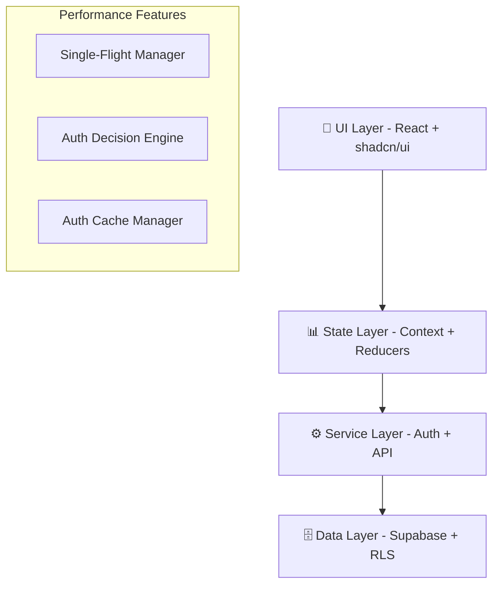
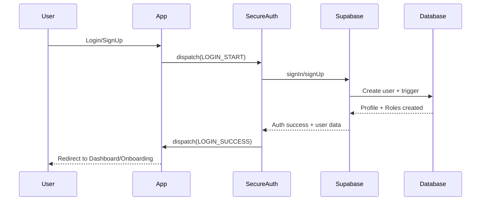
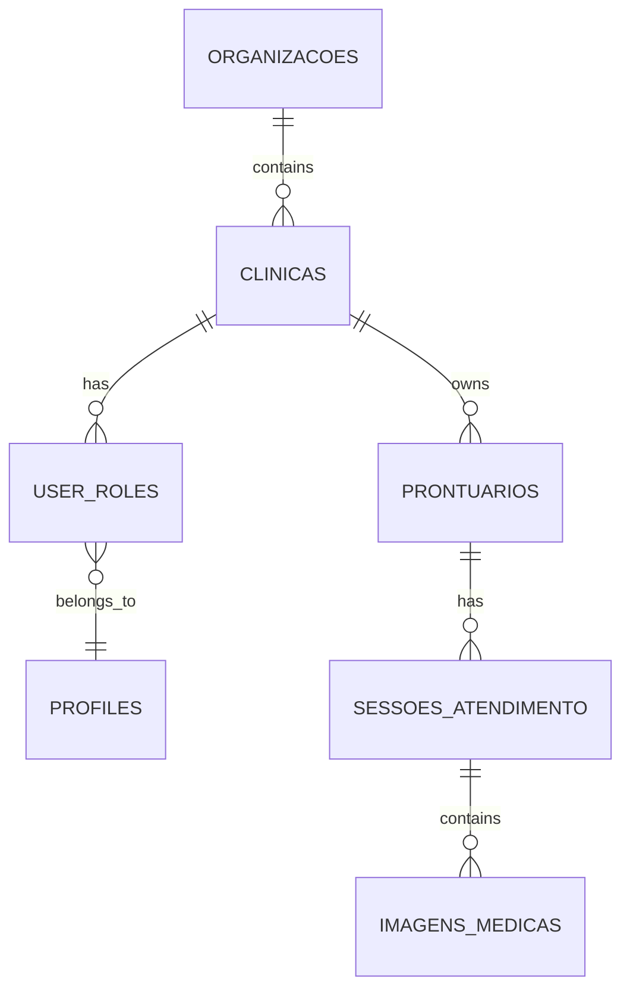

# WARP.md

Este arquivo fornece orientação ao WARP (warp.dev) ao trabalhar com código neste repositório.

---

## 📋 Índice

1. [🚀 Getting Started](#-getting-started)
2. [🏗️ Arquitetura do Sistema](#️-arquitetura-do-sistema)
3. [🔐 Sistema de Autenticação](#-sistema-de-autenticação)
4. [🗄️ Banco de Dados Supabase](#️-banco-de-dados-supabase)
5. [🏥 Multi-Tenant: Clínicas](#-multi-tenant-clínicas)
6. [🧪 Testes e Qualidade](#-testes-e-qualidade)
7. [⚙️ Scripts e DevOps](#️-scripts-e-devops)
8. [🤝 Guia de Desenvolvimento](#-guia-de-desenvolvimento)

---

## 🚀 Getting Started

### Stack Tecnológico
- **Frontend**: React 18.3 + TypeScript + Vite
- **UI/Design**: shadcn/ui + Tailwind CSS + Radix UI
- **Backend**: Supabase (PostgreSQL + Auth + RLS)
- **State Management**: Context API + Reducers
- **Routing**: React Router DOM v6
- **Testes**: Jest + React Testing Library
- **Build/Deploy**: Vite + Vercel

### Comandos Essenciais

```bash
# Desenvolvimento
npm run dev                    # Servidor dev (localhost:5173)
npm run build                 # Build para produção
npm run preview               # Preview do build (localhost:5174)

# Testes e Qualidade
npm run lint                  # ESLint
npm test                      # Executar testes
npm run test:auth             # Testar fluxo de autenticação

# Database e Backend
npm run check:db              # Verificar estrutura do banco
npm run backup                # Backup do Supabase
npm run diagnose              # Diagnóstico de problemas

# Validação de Build
npm run build:validate        # Build + validação
npm run test:routes           # Testar rotas (dev)
npm run test:routes:preview   # Testar rotas (preview)
```

### Estrutura de Diretórios

```
src/
├── components/           # Componentes React
│   ├── ui/              # Componentes shadcn/ui base
│   ├── auth/            # Componentes de autenticação
│   └── executive/       # Dashboard executivo
├── contexts/            # Context providers
│   ├── AuthContext.tsx     # Sistema legacy
│   └── SecureAuthContext.tsx # Sistema V2 otimizado
├── hooks/               # Custom hooks
│   ├── useOptimizedAuth.ts # Hook de auth V2
│   └── useFastAuth.ts   # Verificações rápidas
├── pages/               # Páginas da aplicação
├── utils/               # Utilitários
│   ├── auth-decision-engine.ts # Motor de decisão auth
│   └── single-flight-manager.ts # Gerenciador de requisições
├── integrations/        # Integrações externas
│   └── supabase/        # Cliente e tipos Supabase
└── __tests__/           # Testes unitários e E2E
```

---

## 🏗️ Arquitetura do Sistema

### Camadas da Aplicação



### Principais Padrões Implementados

1. **Single-Flight Pattern**: Evita requisições duplicadas
2. **Auth Decision Engine**: Decisões determinísticas de roteamento  
3. **Multi-Context Architecture**: Auth V1 (legacy) + V2 (otimizado)
4. **Feature Flags**: Migração gradual entre sistemas
5. **Error Recovery**: Sistema automático de recuperação

### Componentes de Alto Nível

```typescript
// Exemplo: Estrutura do Auth Router V2
interface AuthDecision {
  state: 'ANONYMOUS' | 'AUTHENTICATED_NEW' | 'AUTHENTICATED_EXISTING';
  decision: 'REDIRECT_AUTH' | 'REDIRECT_ONBOARDING' | 'ALLOW_ACCESS';
  reason: string;
  redirectPath?: string;
  performanceMs?: number;
}
```

---

## 🔐 Sistema de Autenticação

### Arquitetura Dual (V1 + V2)

O sistema possui dois contextos de autenticação:

1. **AuthContext** (Legacy): Sistema original com algumas limitações
2. **SecureAuthContext** (V2): Sistema otimizado que resolve race conditions

### Fluxo de Autenticação V2



### Hooks de Autenticação

```typescript
// Hook principal V2 com feature flag
const auth = useOptimizedAuth();

// Hook para verificações rápidas
const { isReady, canAccess, needsOnboarding } = useFastAuth();

// Hook de emergência para debug
const { cancelAllFlights, forceRefresh } = useAuthEmergencyControls();
```

### Estados de Autenticação

| Estado | Descrição | Ação |
|--------|-----------|------|
| `ANONYMOUS` | Usuário não autenticado | Redirecionar para `/auth` |
| `AUTHENTICATED_NEW` | Usuário novo (primeiro_acesso = true) | Redirecionar para `/onboarding` |
| `AUTHENTICATED_EXISTING` | Usuário existente | Permitir acesso |

### Roles e Permissões

```typescript
enum UserRole {
  'super_admin',
  'proprietaria',      // Dona da clínica
  'gerente',          // Gerente da clínica  
  'profissionais',    // Médicos, enfermeiros
  'recepcionistas',   // Atendimento
  'visitante',        // Acesso limitado
  'cliente'           // Paciente
}
```

---

## 🗄️ Banco de Dados Supabase

### Principais Tabelas

```sql
-- Usuários e perfis
profiles              -- Perfil do usuário (1:1 com auth.users)
user_roles           -- Roles por clínica (N:N)

-- Multi-tenancy  
organizacoes         -- Grupos de clínicas (opcional)
clinicas            -- Clínicas individuais
clinica_profissionais -- Profissionais por clínica

-- Prontuários médicos
prontuarios                 -- Prontuários principais
sessoes_atendimento        -- Sessões de atendimento
imagens_medicas           -- Imagens seguras
consentimentos_digitais   -- Consentimentos com hash
auditoria_medica         -- Log de auditoria

-- Templates e configuração
templates_procedimentos   -- Templates reutilizáveis
especialidades_medicas   -- Especialidades disponíveis
```

### Enums Importantes

```sql
-- Roles de usuário
CREATE TYPE user_role_type AS ENUM (
  'super_admin', 'proprietaria', 'gerente', 
  'profissionais', 'recepcionistas', 'visitante', 'cliente'
);

-- Tipos de procedimento
CREATE TYPE tipo_procedimento AS ENUM (
  'botox_toxina', 'preenchimento', 'harmonizacao_facial',
  'laser_ipl', 'peeling', 'tratamento_corporal', 
  'skincare_avancado', 'outro'
);

-- Status do prontuário
CREATE TYPE status_prontuario AS ENUM (
  'ativo', 'arquivado', 'transferido'
);
```

### Row Level Security (RLS)

O sistema usa RLS para isolamento multi-tenant:

```sql
-- Exemplo: Usuários só veem próprios dados
CREATE POLICY "users_select_own" ON profiles
  FOR SELECT USING (auth.uid() = user_id);

-- Exemplo: Acesso à clínica baseado em role
CREATE POLICY "clinics_select_accessible" ON clinicas  
  FOR SELECT USING (
    id IN (
      SELECT clinic_id FROM user_clinic_roles 
      WHERE user_id = auth.uid() AND active = true
    )
  );
```

### Comandos de Migração e Seeds

```bash
# Reconstruir banco completo (cuidado!)
psql -f REBUILD_DATABASE_COMPLETE.sql

# Scripts utilitários do projeto
npm run check:db              # Verificar estrutura
npm run create:tables         # Criar tabelas faltantes  
npm run backup:schema         # Backup apenas schema
npm run backup:data           # Backup apenas dados

# Scripts de seed e dados
npm run seed:reference        # Inserir dados de referência
npm run seed:dev              # Dados de desenvolvimento
npm run seed:prod             # Dados de produção (apenas essenciais)
npm run test:db               # Testes básicos de funcionalidade
npm run validate:integrity    # Validar integridade do banco
```

### Estrutura de Seeds

O sistema possui três tipos de seeds organizados por ambiente:

```
supabase/seed/
├── reference-data/           # Dados essenciais (prod + dev)
│   ├── 01_especialidades_medicas.sql
│   ├── 02_categorias_procedimento.sql
│   ├── 03_fabricantes_equipamento.sql
│   └── 00_execute_all_reference_seeds.sql
├── dev-sample/              # Dados fictícios (apenas dev)
│   └── dev_sample_data.sql
├── production/              # Dados essenciais (apenas prod)
│   └── production_seeds.sql
├── rls-audit-and-setup.sql  # Configuração RLS
├── validate_database_integrity.sql # Validação
└── test_basic_functionality.js     # Testes básicos
```

---

## 🏥 Multi-Tenant: Clínicas

### Modelo de Dados



### Isolamento de Dados

- **Organizational Level**: `organizacao_id` nas tabelas principais
- **Clinic Level**: `clinica_id` para isolamento por clínica  
- **User Level**: RLS baseado em `auth.uid()` e roles

### Onboarding de Nova Clínica

1. Usuário faz signup (cria auth.users + profiles)
2. Sistema detecta `primeiro_acesso = true`
3. Redireciona para `/onboarding`
4. OnboardingWizard coleta dados da clínica
5. Cria registro em `clinicas` + `user_roles` com role `proprietaria`
6. Atualiza `profiles.primeiro_acesso = false`

```typescript
// Exemplo: Criar clínica no onboarding
const createClinic = async (data: OnboardingData) => {
  const { data: clinic } = await supabase
    .from('clinicas')
    .insert({
      nome: data.clinicName,
      cnpj: data.cnpj,
      endereco: data.address,
      // ...
    })
    .select()
    .single();
    
  // Criar role de proprietária
  await supabase.from('user_roles').insert({
    user_id: user.id,
    clinica_id: clinic.id,
    role: 'proprietaria'
  });
};
```

---

## 🧪 Testes e Qualidade

### Stack de Testes

- **Unitários**: Jest + React Testing Library
- **E2E**: Testes de fluxo completo de auth
- **Performance**: Métricas de decision engine
- **Coverage**: Minimum 90% em módulos críticos

### Estrutura de Testes

```
src/__tests__/
├── auth-flow-e2e.test.tsx         # Fluxos completos
├── auth-decision-engine.test.ts   # Motor de decisão
├── authCache.test.ts             # Sistema de cache
├── retryUtils.test.ts            # Utilitários de retry
├── AuthGuard.test.tsx            # Componente guard
└── NavigationContext.test.tsx    # Contexto navegação
```

### Comandos de Teste

```bash
npm test                          # Executar todos os testes
npm run test:auth                # Testar fluxo de auth
npm run test:policies            # Testar políticas RLS
npm run test:user                # Testar criação de usuário
npm run test:db                  # Testes básicos de banco
node supabase/seed/test_basic_functionality.js  # Executar testes direto
```

### ✅ Checklist RLS (Row Level Security)

**Tabelas com RLS Obrigatório:**
- [ ] `profiles` - Usuários veem apenas seus dados
- [ ] `user_roles` - Acesso baseado em organização/clínica
- [ ] `clinicas` - Isolamento por organização
- [ ] `organizacoes` - Acesso baseado em roles
- [ ] `prontuarios` - Isolamento por clínica
- [ ] `sessoes_atendimento` - Via prontuários
- [ ] `imagens_medicas` - Via prontuários
- [ ] `equipamentos` - Por clínica
- [ ] `produtos` - Por clínica
- [ ] `auditoria_medica` - Por clínica (apenas INSERT)

**Tabelas de Acesso Público (usuários autenticados):**
- [ ] `especialidades_medicas` - Leitura livre
- [ ] `categorias_procedimento` - Leitura livre
- [ ] `fabricantes_equipamento` - Leitura livre

**Cenários de Teste RLS:**
1. **Super Admin**: Acessa todos os dados
2. **Proprietária**: Acessa apenas sua organização/clínica
3. **Profissional**: Acessa apenas clínicas onde trabalha
4. **Recepcionista**: Acesso limitado à sua clínica
5. **Usuário não autenticado**: Sem acesso a dados sensíveis

### Mocking Supabase

```typescript
// Mock padrão para testes
jest.mock('@/integrations/supabase/client', () => ({
  supabase: {
    auth: {
      getSession: jest.fn(),
      getUser: jest.fn(),
      onAuthStateChange: jest.fn(() => ({
        data: { subscription: { unsubscribe: jest.fn() } }
      }))
    },
    from: jest.fn(() => ({
      select: jest.fn(() => ({
        eq: jest.fn(() => ({
          maybeSingle: jest.fn(),
          single: jest.fn()
        }))
      }))
    }))
  }
}));
```

### Metas de Qualidade

```javascript
// jest.config.js
coverageThreshold: {
  global: {
    branches: 90,
    functions: 90,
    lines: 90,
    statements: 90
  }
}
```

---

## ⚙️ Scripts e DevOps

### Utilitários de Banco

```bash
# Diagnóstico e verificação
npm run check:db                 # Verificar estrutura do banco
npm run check:profiles          # Verificar tabela profiles  
npm run check:roles             # Verificar tabela user_roles
npm run debug:user              # Debug dados de usuário

# Correções automáticas
npm run fix:profiles            # Corrigir estrutura profiles
npm run complete:onboarding     # Completar onboarding forçado
npm run create:roles            # Criar roles faltantes

# Backup e restauração
npm run backup                  # Backup completo
npm run backup:schema           # Apenas schema
npm run backup:data             # Apenas dados
npm run restore                 # Restaurar backup
```

### Variáveis de Ambiente

```env
# Supabase
VITE_SUPABASE_URL=https://xxx.supabase.co
VITE_SUPABASE_ANON_KEY=xxx
SUPABASE_SERVICE_ROLE_KEY=xxx   # Para scripts admin

# Auth V2 (opcional)
JWT_SECRET=your-super-secret-jwt-key
JWT_EXPIRES_IN=15m
JWT_REFRESH_EXPIRES_IN=7d
AUTH_V2_ENABLED=true

# Development
NODE_ENV=development
VITE_APP_ENV=development
```

### Deploy (Vercel + Supabase)

1. **Build de Produção**:
   ```bash
   npm run build:validate       # Build + validação
   ```

2. **Deploy Vercel**:
   - Conectar repositório GitHub
   - Configurar variáveis de ambiente
   - Deploy automático em push para `main`

3. **Migração de Banco**:
   - Use interface Supabase para aplicar `REBUILD_DATABASE_COMPLETE.sql`
   - Ou execute scripts de migração individuais

### CI/CD Pipeline

```yaml
# .github/workflows/ci.yml (sugestão)
name: CI
on: [push, pull_request]
jobs:
  test:
    runs-on: ubuntu-latest
    steps:
      - uses: actions/checkout@v3
      - uses: actions/setup-node@v3
      - run: npm ci
      - run: npm run lint
      - run: npm run test
      - run: npm run build
```

---

## 🤝 Guia de Desenvolvimento

### Convenções de Código

1. **TypeScript**: Estritamente tipado, interfaces explícitas
2. **React**: Hooks funcionais, evitar class components
3. **Styling**: Tailwind + shadcn/ui, evitar CSS custom
4. **Auth**: Sempre use hooks otimizados (`useFastAuth`, `useOptimizedAuth`)

### Padrões de Commit

```bash
feat: add new authentication system
fix: resolve infinite redirect loop  
refactor: optimize auth decision engine
docs: update WARP.md with new patterns
test: add e2e tests for onboarding flow
```

### Fluxo de Desenvolvimento

1. **Feature Branch**: `git checkout -b feature/nova-funcionalidade`
2. **Development**: Implementar + testes
3. **Quality Check**: `npm run lint && npm test && npm run build`
4. **Pull Request**: Revisão de código obrigatória
5. **Deploy**: Merge para `main` = deploy automático

### Debugging Auth

```typescript
// Hook para diagnóstico completo
const diagnostics = useAuthDiagnostics();
console.log('Auth Diagnostics:', {
  state: diagnostics.state,
  decision: diagnostics.decision,
  performance: diagnostics.performanceMs,
  flights: diagnostics.flightStatus
});

// Controles de emergência  
const emergency = useAuthEmergencyControls();
emergency.cancelAllFlights();  // Cancelar requests pendentes
emergency.forceRefresh();      // Forçar reload da página
emergency.forceLogout();       // Logout completo + limpeza
```

### Resolução de Problemas Comuns

| Problema | Causa Provável | Solução |
|----------|----------------|---------|
| Loop infinito de redirect | Race condition entre guards | Usar `useOptimizedAuth()` V2 |
| Dados de usuário faltando | Trigger de criação falhou | `npm run fix:profiles` |
| RLS negando acesso | Role não configurado | `npm run check:roles` |
| Loading infinito | Timeout de requisição | `useOptimizedLoading()` com timeout |

### 🔄 Como Regenerar Dados

**Para Desenvolvimento:**
```bash
# 1. Limpar dados existentes (opcional)
# DELETE FROM todas as tabelas de dados (mantém estrutura)

# 2. Executar seeds de referência
psql -f supabase/seed/reference-data/00_execute_all_reference_seeds.sql
# OU usar via JavaScript:
node -e "/* script de inserção via Supabase client */"

# 3. Executar dados de desenvolvimento  
psql -f supabase/seed/dev-sample/dev_sample_data.sql

# 4. Configurar RLS
psql -f supabase/seed/rls-audit-and-setup.sql

# 5. Validar integridade
psql -f supabase/seed/validate_database_integrity.sql
```

**Para Produção:**
```bash
# APENAS dados essenciais - sem dados fictícios
psql -f supabase/seed/production/production_seeds.sql
psql -f supabase/seed/rls-audit-and-setup.sql
```

**Teste Rápido:**
```bash
# Executar testes básicos para validar funcionamento
node supabase/seed/test_basic_functionality.js
```

### Roadmap Futuro

- [ ] **Módulo Financeiro**: Faturamento de procedimentos
- [ ] **Relatórios Avançados**: Analytics e KPIs
- [ ] **Integração WhatsApp**: Comunicação com pacientes  
- [ ] **Mobile App**: React Native + Expo
- [ ] **API Pública**: REST API para integrações
- [ ] **Multi-idioma**: i18n completo
- [ ] **Testes E2E Automatizados**: Cypress/Playwright completo
- [ ] **Pipeline CI/CD**: Testes automáticos em PR

---

## 📚 Recursos Adicionais

- **Documentação Supabase**: https://supabase.com/docs
- **shadcn/ui Components**: https://ui.shadcn.com
- **React Router v6**: https://reactrouter.com
- **Tailwind CSS**: https://tailwindcss.com

---

**Última atualização**: Janeiro 2025  
**Versão do sistema**: v2.0 (Auth otimizado)  
**Status**: 🟢 Produção estável